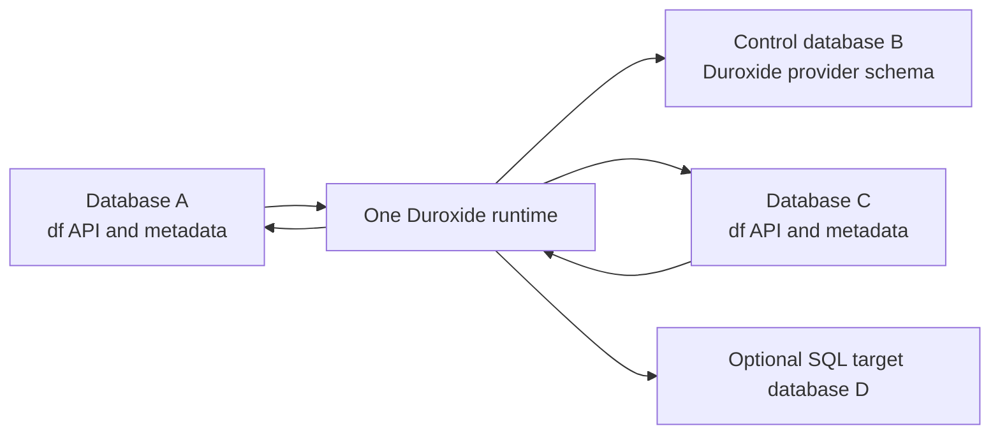

# Multi-Database Extension Installation

**Status:** Implemented in 0.2.8
**Date:** 2026-09-10

## Summary

pg_durable already supports executing a workflow's SQL in another database through
the `database` argument to `df.start()`. That feature is documented in
[`multi-database.md`](multi-database.md). This document describes a different
capability: installing `pg_durable` in multiple databases so each database has a
local `df` API, local metadata, local privileges, and local transaction semantics.

The implemented architecture is:

- Keep exactly one Duroxide runtime and provider schema in the database selected by
  `pg_durable.database`. This is the **control database**.
- Require an explicit control-plane `CREATE EXTENSION pg_durable` in that database.
  Preloading starts worker initialization and control-installation checks, but
  creates no provider objects before explicit `CREATE EXTENSION`.
- Permit additional **satellite installations** in other databases. Each satellite
  owns its local `df` schema, `df.instances`, `df.nodes`, `df.vars`, functions,
  privileges, and RLS policies, but no active Duroxide provider schema.
- Namespace satellite engine IDs with the origin database and installation identity.
  Activities derive their route from `ActivityContext`; recorded orchestration and
  activity payloads are unchanged. Duroxide client operations use the control database.
- Treat the control installation as the lifecycle anchor. Do not attempt automatic
  cross-database reference counting for creation or removal of the runtime.

This preserves the most important local behavior: a normal `df.start()` writes its
graph in the caller's transaction and is rolled back with that transaction.

## Problem Frame

PostgreSQL extensions and their dependencies are database-local. The pg_durable
background worker, however, is registered once per cluster from
`shared_preload_libraries`, and the desired Duroxide runtime is also cluster-wide.
Before 0.2.8, the extension could be installed only in `pg_durable.database`.

Users instead expect this topology:



The origin database, Duroxide control database, and SQL execution database are
three distinct concepts. They may be the same database, but the implementation
must not assume that they are.

## Requirements

### Installation And Lifecycle

- **R1.** `CREATE EXTENSION pg_durable` must remain required in
  `pg_durable.database` before provider creation and durable execution start.
  Worker initialization, management connections, and polling may precede it.
- **R2.** `CREATE EXTENSION pg_durable` must be allowed in additional databases once
  a compatible control installation exists.
- **R3.** A satellite installation must create its local `df` API and metadata but
  must not create or own a second active Duroxide provider schema.
- **R4.** Dropping a satellite must not stop the shared runtime or remove the
  control database's Duroxide schema.
- **R5.** Dropping the control installation must stop the runtime and remove the
  provider schema as it does today. Remaining satellites must fail new control-plane
  operations with a clear "control installation unavailable" error.
- **R6.** Loading `pg_durable` through `shared_preload_libraries` without a control
  installation must continue to leave no Duroxide schema behind.

### Workflow Behavior

- **R7.** A workflow started in database A must persist `df.instances`, `df.nodes`,
  and `df.vars` state in A, subject to A's RLS and extension privileges.
- **R8.** The default SQL execution database must be the database where
  `df.start()` was called. An explicit `database` argument may still target another
  database on the cluster.
- **R9.** `transaction_mode => 'caller'` must retain its current commit/rollback
  behavior. The worker must probe graph visibility and the originating XID in the
  origin database.
- **R10.** Status, result, explain, signal, cancel, await, and instance-listing APIs
  called in A must operate on A's local instances while consulting the shared
  Duroxide store when engine state is required.
- **R11.** Engine instance identity must be globally unique across installations;
  two databases generating the same current eight-character local ID must not
  address the same Duroxide orchestration.

### Security And Operations

- **R12.** SQL nodes must continue to connect as the captured `current_user` in the
  execution database. Installing pg_durable in another database must not grant that
  role any new execution privilege there.
- **R13.** The worker credential must be authorized explicitly in every satellite
  database it manages. A non-superuser `BYPASSRLS` role still needs the necessary
  object privileges and `CONNECT` privilege.
- **R14.** HTTP privilege checks must be evaluated against `df.http()` or
  `df.http_multipart()` in the workflow's origin installation, not accidentally
  against the control installation.
- **R15.** Connection growth must be bounded independently of the number of
  installed databases. Installing 100 satellites must not eagerly allocate 100
  full management pools.
- **R16.** The single worker must tolerate a rolling extension upgrade in which the
  control and satellite databases temporarily have different extension schema
  versions within the supported binary-compatibility range.

## Implementation Map

| Area | Implemented contract |
|---|---|
| [Install DDL](../src/lib.rs) | Local `df` objects everywhere; extension-owned provider namespace only in the control database. Satellite objects belong to the installer; provider objects inside the control namespace are created by `worker_role`. |
| [Origin routing](../src/origin.rs) | Database OID plus installation UUID, short-lived guarded routes, and a shared connection semaphore. |
| [Activity registry](../src/registry.rs) | Route graph admission, metadata updates, SQL defaults, and HTTP authorization using `ActivityContext`. |
| [Backend readiness](../src/types.rs) | Satellites discover the control schema and readiness over SQLx using the worker credential, without a lifetime schema cache. |
| [Worker maintenance](../src/worker.rs) | Retention and orphan reconciliation visit registered origins in bounded batches. |

## Implemented Architecture

### 1. Explicit Control Installation

The control database remains the only owner of the provider schema and the only
database whose extension lifecycle starts or stops the runtime. Administrators use:

```sql
-- In the database named by pg_durable.database:
CREATE EXTENSION pg_durable;

-- Then, in each additional database:
CREATE EXTENSION pg_durable;
```

Satellite creation verifies over SQLx that the control installation exists and its
worker readiness schema version is at least `2`, which includes the `_origins`
registry. It does not create the control extension automatically.
An automatic remote `CREATE EXTENSION` would commit independently from the local
installation transaction, so a local rollback could leave an unexpected control
installation and provider schema behind.

This explicit anchor removes the need for lifecycle reference counting. Runtime
initialization follows control creation; shutdown follows detection of control
removal, regardless of satellite count. Removal order is satellites first, control last.

The provider namespace is extension-owned (`_duroxide` on fresh control installs,
legacy `duroxide` on older upgraded installs). Objects inside it are created by
`pg_durable.worker_role` through worker-only `ApplyAll` migrations and readiness
initialization. Satellite DDL belongs to the local installer and creates neither
provider namespace nor provider objects.

### 2. Local Metadata, Shared Engine

Each satellite retains local metadata and local SPI operations. Public instance
IDs remain eight hexadecimal characters. Satellite engine IDs have this form:

```text
pgdf-<databaseOID>-<installationUUID>-<localID>
```

The UUID is stored in local `df._installation` and encoded without hyphens in the
engine ID. Database OID permits rename-safe lookup through `pg_database`; the UUID
fences work from a dropped/recreated installation. Activities parse the root ID
from `ActivityContext.instance_id()`, including for existing `::` child-ID suffixes.

No origin fields are added to recorded orchestration or activity payloads. Child
composition, `continue_as_new`, and control-database replay remain unchanged.
Control instances continue to use their unprefixed local IDs, including on older
schemas without `df._installation`.

### 3. Database-Aware Activity Routing

The activity registry uses an origin router for:

- graph load and transaction admission;
- instance and node status updates;
- HTTP and multipart privilege checks;
- retention and orphan reconciliation.

SQL execution remains separate. Its effective target is:

```text
explicit df.start(database => ...) ?? origin database
```

For SQL activities, a null execution database defaults to the origin through the
runtime route; an explicit database remains a separate SQL target.
When SQL targets its own satellite, its submitting-user connection revalidates
the database OID and installation UUID after SQL admission. That transaction
retains the installation relation lock through statement execution and commit,
preventing a force-dropped database's queued work from reaching a same-name replacement.

`pg_durable.max_origin_connections` bounds origin connections across activities and
maintenance: default `12`, minimum `2`, maximum `1000`, Postmaster context (restart
required). Each active route reserves two slots: one installation-guard transaction
and one metadata connection. Routes close their pools when finished; there is no
idle pool per database or database-name count ceiling. The control pool remains
governed by `pg_durable.max_management_connections`; SQL execution connections have
their separate existing budget.

Origin metadata connections enforce a 1.5-second lock timeout and a 5-second
statement timeout, including secondary activity queries. Guard transactions disable
idle-in-transaction and, where supported, transaction timeouts so a long SQL or
HTTP operation does not silently lose its installation lock. These metadata
deadlines do not set a timeout on user SQL or HTTP requests.

### 4. Control-Plane Backend Calls

The following operations use a SQLx/Duroxide client connection to
the control database:

- start orchestration;
- cancel orchestration;
- raise signal/event;
- fetch instance/execution details;
- fetch system metrics;
- direct calls to Duroxide's published `get_instance_info` function.

Satellite readiness and provider-schema discovery also use the control connection.
Each satellite backend reuses one direct control-state connection on its cached
runtime, but rechecks extension identity, schema, and readiness on every operation.
Remote probes have 1.5-second server deadlines and a 5-second overall deadline;
failures discard the connection without falling back to stale readiness or a
satellite provider. Control-local callers use SPI so readiness changes in their
own transaction remain visible and do not require an extra control-state connection.
Instance operations authorize through local SPI/RLS before addressing engine state
under the worker credential. `df.metrics()` is the explicit administrative exception:
it reports totals for the entire shared engine, including every satellite.

`transaction_mode => 'new'` opens its loopback launch session in the caller's
database, regardless of the SQL execution target. Its advisory admission limit,
`pg_durable.max_new_transaction_starts`, is **per database**, not cluster-wide.
Caller-mode graph persistence and transaction admission remain origin-local.

### 5. Origin Registry For Maintenance, Not Ownership

The control provider schema's `_origins` table records database OID/installation UUID
pairs idempotently through activity routing for submitted work. `df.start()` does
not synchronously register the origin. Only origins submitting work are discovered,
not all installed extensions. The registry supports maintenance, not ownership or
an exact transactional reference count.

Exact cross-database reference counting is not reliable with ordinary extension
DDL: extension catalogs and dependencies are database-local, and registration over
a second connection commits or rolls back independently. There is no all-database
discovery scan or `ProcessUtility_hook`; correctness uses local installation locks,
UUID fencing, and eventual reconciliation.

## Lifecycle And Failure Semantics

### Satellite Drop

Dropping a satellite is destructive to that installation's work only. It leaves
the control provider and other satellites intact. During an active satellite
activity, a guard transaction holds `ACCESS SHARE` locks on `df._installation`,
`df.instances`, and `df.nodes`, so `DROP EXTENSION` waits for active operations.
This is not a nonterminal-instance drop veto: sleeping or queued work does not
prevent a drop, and there is no DDL hook or reference count.

Every activity, including one with a cached graph or an explicit remote SQL target,
must validate the installation UUID before executing. Old work cannot execute
against a recreated installation. Bounded reconciliation cancels running roots
after confirming removal; cancellation does not wait for the retention cutoff.
Deletion of terminal engine records remains subject to retention. Neither action
is immediate at DDL commit. Previously committed SQL or external HTTP effects
are not undone.

### Control Drop

Dropping the control extension destroys the shared engine state for **every
satellite** and causes the worker to stop the runtime when it detects the drop.
There is no cross-database dependency or registry veto. Remaining satellite metadata
does not restore the lost engine history; recreating control is not recovery of old
work. Remove satellites first and control last.

### Database Rename Or Drop

Origin routing resolves the current database name from its OID before connecting.
Reconciliation treats a missing database OID, missing extension-owned installation
table, or replaced installation UUID as removal. An unreachable database, denied
connection, or failed probe is **not** evidence of absence: cleanup is deferred.
Explicit SQL target names remain names and are not rename-tracked by this route.

### Mixed Versions

The shared object is cluster-wide, but `pg_extension.extversion` is per database.
An older supported control schema works with the new binary without local
`df._installation`; its IDs and replay path remain unchanged. Satellites require
the new local identity/validator DDL and control worker readiness version `2`.
This readiness protocol, not equal extension version strings, gates installation.

## Security Considerations

- PostgreSQL roles and role OIDs are cluster-wide, but database `CONNECT`, schema,
  table, and function privileges are database-local.
- The default worker role is the `postgres` superuser. A custom worker role needs
  database-local `CONNECT`, access to `df` metadata and the installation guard, and
  permission to perform origin-local HTTP privilege lookup in every managed origin.
  `BYPASSRLS` bypasses row policies only; it grants no database or object privileges.
- The caller must never be allowed to supply an arbitrary origin database or
  installation ID in raw workflow JSON. The C entrypoint derives origin identity
  from the current database and local installation row.
- Engine operations run under the worker credential. Every signal, cancellation,
  result lookup, and detailed monitoring operation must first prove local ownership
  through SPI/RLS in the origin database.
- An explicit SQL target database still executes as `submitted_by`, so normal
  `CONNECT` and SQL privileges remain the execution boundary.
- HTTP authorization is attached to the origin installation. Granting HTTP in
  database A must not implicitly grant it in database C.
- `df.grant_usage(..., with_grant => true)` delegates local administration and grants
  `df.metrics()` access. Even when granted in a satellite, this exposes all-engine
  aggregate totals across users and origins, not merely that satellite's activity.
- Dynamic database and schema identifiers must be resolved from trusted catalog
  values and quoted as identifiers; user input remains bound as query parameters.

## Alternatives Considered

### Eager Runtime From `shared_preload_libraries`

Rejected. Creating persistent provider objects on preload would leave them without
an explicit `CREATE EXTENSION` lifecycle owner. Uninstall and downgrade behavior would be
unclear, and removing the library from configuration cannot transactionally clean
database objects.

### Automatic Cross-Database Reference Counting

Rejected as the lifecycle foundation. A satellite's extension transaction cannot
atomically update a registry in the control database using an ordinary second
connection. Failed installs, forced drops, database removal, and restore can all
leave the count stale. Eventual registration is still useful for maintenance.

### Centralize All `df` Metadata In The Control Database

Rejected. Satellite functions could proxy every operation to the control
database, but `transaction_mode => 'caller'` could no longer naturally couple graph
persistence to the caller's local transaction. It would also require securely
forwarding caller identity for RLS and make local monitoring and grants surprising.

### One Runtime Per Installed Database

Rejected for this goal. It gives natural local semantics but multiplies Tokio
runtimes, provider pools, listeners, migrations, retention loops, and resource
budgets. It also contradicts the requirement for one Duroxide runtime and schema.

## Deferred Limitations

- Registry discovery begins with work submission, not installation. There is no
  complete cross-database installation inventory or administrative instance list.
- Satellite drop has no instant cancellation notification; active-operation locks
  and UUID fencing provide safety while reconciliation performs eventual cleanup.
- Local metadata, control enqueue, and explicit SQL targets do not share a
  cross-database atomic transaction. Caller-mode admission preserves local
  commit/rollback behavior, but does not provide distributed transactions.
- There is no per-node database targeting or idle SQL/metadata pool per satellite.

## Verification

The E2E coverage includes origin routing (`14_database`), isolation and installation
replacement (`72_multi_database_lifecycle`), maintenance (`73_multi_database_reconcile`),
lock ordering and cancellation cleanup (`74_multi_database_guards`), and forced
database replacement during SQL admission (`75_multi_database_force_drop`). Pure
tests cover identity parsing, bounded control probes, and retention cursor progress.
The release gates remain full unit/E2E suites, formatting, build, Clippy, and upgrade
testing; focused regressions do not replace them.

## Upgrade And Migration

This feature changes local extension DDL, engine identity for satellite starts, and
runtime routing. It does not change recorded orchestration or activity payloads.

- **B1 binary compatibility:** control IDs bypass the installation-identity lookup,
  so supported old schemas without `df._installation` still work. Missing
  `df.duroxide_schema()` retains the legacy `duroxide` fallback. Control replay and
  existing child composition are unchanged by this feature.
- **Upgrade DDL:** the multi-database additions in
  [0.2.7 to 0.2.8](../sql/pg_durable--0.2.7--0.2.8.sql) are `df._installation`
  (singleton UUID, public read-only access) and `df.validate_installation()`, invoked
  by the upgrade. There is no engine-ID mapping column or provider DDL in this SQL.
  The separate loop API change in that script is described in
  [Upgrade Testing](upgrade-testing.md#028).
- **Runtime schema detection:** satellites resolve control schema/readiness over
  SQLx. The worker creates `_origins` before publishing readiness version `2`;
  worker-only `ApplyAll` manages provider migrations in control, never satellites.
- **Upgrade order and gates:** deploy/restart the new binary and wait for a ready
  control installation before creating satellites. Equal extension schema versions
  are not required. Scenario A must compare like-for-like control installs; B1
  covers all supported old control schemas, and B2 checks retained data and work.
  Fresh satellites must have local identity and no provider schema. These remain
  validation requirements, not assertions that full gates have passed.