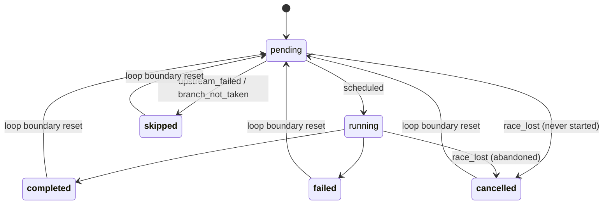
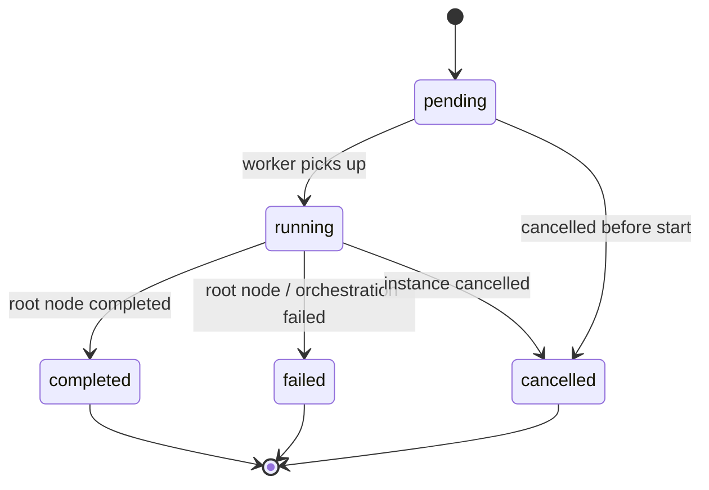
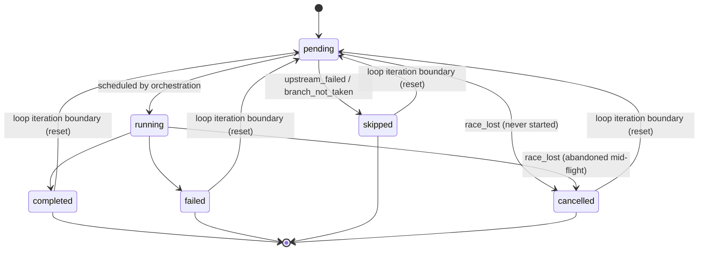
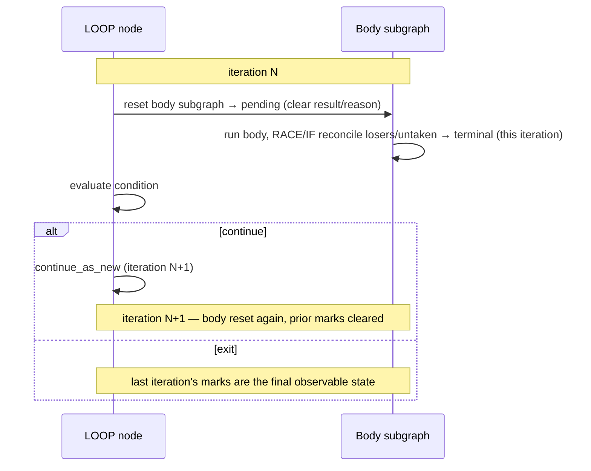

# Node & Instance State Model

Status: **Design proposal** (consolidates issues [#240] and [#171]).

This document defines the lifecycle states that `pg_durable` workflow **instances**
and **nodes** move through, the legal transitions between them, and the reason a
node ends in a non-executed terminal state. It exists so that operators inspecting
`df.instances` / `df.nodes` (and the `df.status()` / `df.instance_nodes` views) can
unambiguously tell *what happened* to every step of a run.

## Proposal summary

This is the proposed transition graph for node states (states in **bold** are
terminal):

**Loop reset:** a `LOOP` body node has one row but runs once per iteration, so at each `continue_as_new` boundary the loop-body subgraph is reset to `pending`, preventing stale terminal marks from leaking into the next iteration (see [Loops and node-state reuse](#loops-and-node-state-reuse-iteration-scoping)).

**Key open decision** — how `df.nodes` projects looped nodes:

- **Latest-only row + loop reset** (this proposal): one mutable row per node; simplest, but no per-iteration history in SQL.
- **Per-execution rows** (`df.node_executions` keyed by `(node_id, iteration)`, à la Airflow): full per-iteration history and no reset needed, at the cost of a heavier schema.

---

## Reference model

We align with **Apache Airflow's `TaskInstance` state model**, which is the closest
well-known analog: a DAG of steps with branching, short-circuiting, and parallelism.
The decisions below also stay consistent with **Temporal** (durable-execution
semantics, since `pg_durable` runs on duroxide) at the instance level, and borrow
**BPMN 2.0's** notion of a *withdrawn* activity for race-losers.

| Concept here | Airflow | Temporal | BPMN 2.0 | AWS Step Functions |
|---|---|---|---|---|
| Step ran OK | `success` | `Completed` | `Completed` | `SUCCEEDED` |
| Step errored | `failed` | `Failed` | `Failed` | `FAILED` |
| Not run — upstream failed | `upstream_failed` | (n/a) | `Terminated` | `ABORTED` |
| Not run — branch not taken | `skipped` | (n/a) | `Withdrawn` | (n/a) |
| Abandoned — lost a race | (cancelled) | `Canceled` | `Withdrawn` | `ABORTED` |
| Run still in flight, not reached | `scheduled`/`none` | `Scheduled` | `Ready` | `RUNNING` |

Citing this lets us say: *"node states follow Airflow's task-instance model, with
BPMN 'withdrawn' semantics for race-losers and Temporal alignment at the instance
level."*

The crucial lesson from Airflow: **"not executed" is more than one state.** Airflow
deliberately separates `skipped` (a branch deliberately not taken) from
`upstream_failed` (blocked by a failure). We adopt that distinction — but capture
the nuance in a **reason** rather than an ever-growing status enum (see below).

## Design decision: coarse status + reason

We keep a **small, stable terminal status set** and add a nullable **`status_reason`**
that explains *why* a node reached a non-obvious terminal state.

Rationale:

- `pg_durable` is a PostgreSQL extension with a strict schema-upgrade contract (see
  [docs/upgrade-testing.md](upgrade-testing.md)). Every new status value is a
  `CHECK` constraint migration plus a binary backward-compatibility concern. Adding
  statuses should be rare.
- A reason column captures arbitrarily fine nuance (`upstream_failed`,
  `branch_not_taken`, `race_lost`, `loop_not_entered`, …) without schema churn, and
  is exactly the "note or reason" operators want when debugging.
- It keeps dashboards simple: filter on a handful of statuses, drill into the reason.

### Node status set

| Status | Terminal | Meaning |
|---|---|---|
| `pending` | no | Materialized by `df.start()`, not yet started. |
| `running` | no | Currently executing. |
| `completed` | yes | Finished successfully (may carry `result`). |
| `failed` | yes | Raised an error (carries error in `result`). |
| `skipped` | yes | Eligible work that was never started because the run already terminated, or a branch the run chose not to take. **(#240, new in 0.2.4)** |
| `cancelled` | yes | Work that had started (`running`) or was queued and was abandoned because its enclosing scope (a decided `RACE`) no longer needs it. **(#171, proposed)** |

> Current state of the code: `pending`, `running`, `completed`, `failed`, and
> `skipped` exist; `skipped` was added in 0.2.4 for issue #240 (PR #249).
> `cancelled` for **nodes** is proposed here for #171 (the `df.instances` table
> already has a `cancelled` status, but `df.nodes` does not yet).

### `status_reason` vocabulary (proposed)

`status_reason` is `NULL` for the self-explanatory terminal states (`completed`,
`failed` carrying their own error). It is populated for `skipped` / `cancelled`:

| Reason | Applies to | Set when |
|---|---|---|
| `upstream_failed` | `skipped` | A prior/sibling step failed and the run is terminating ([#240]). |
| `branch_not_taken` | `skipped` | An `IF`/`LOOP` condition chose another path, so this branch never runs. |
| `race_lost` | `cancelled` | This node is in the losing branch of a resolved `RACE` ([#171]). |
| `scope_cancelled` | `cancelled` | A reserved, more general form for future cancellation scopes. |

## Instance state model

Instance statuses are **unchanged** by this work (it is a non-goal to alter instance
vocabulary). They are: `pending`, `running`, `completed`, `failed`, `cancelled`
(see `instances_status_chk` in [src/lib.rs](../src/lib.rs)).

A node-level failure drives the instance to `failed`; node-level `skipped` /
`cancelled` reconciliation happens *underneath* a `failed` (or `completed`, for race
winners) instance and does not change the instance status.

## Node state model

Invariants:

- `result` may only be non-NULL when status is `completed` or `failed`
  (enforced today by `nodes_result_status_chk`). `skipped` and `cancelled` carry no
  `result`; the explanation lives in `status_reason`.
- **Within a single loop iteration (or a non-looping run), terminal is final:** a
  reconciliation pass never moves an already-terminal node to a different terminal
  state. The *only* terminal → non-terminal transition is the explicit
  **loop iteration-boundary reset** (terminal → `pending`), which clears the body
  subgraph between iterations (see [Loops and node-state reuse](#loops-and-node-state-reuse-iteration-scoping)).
  Outside a loop, that reset never fires, so terminal states are truly final.

## Per-construct outcomes

How each construct's children may end. "Children" = the nodes referenced by
`left_node` / `right_node` (and `extra_nodes` for `JOIN`/`RACE` of arity > 2).

| Construct | On success | On failure of a child | Notes |
|---|---|---|---|
| `SQL` / `HTTP` / `SLEEP` / `WAIT_SCHEDULE` / `SIGNAL` | self `completed` | self `failed` | Leaf nodes; no children. |
| `THEN` (sequence) | both children `completed` | failing child `failed`; **later children `skipped` (`upstream_failed`)** | The #240 case. Right branch is never reached after a left failure. |
| `IF` | taken branch runs; **untaken branch `skipped` (`branch_not_taken`)** | condition failure ⇒ IF `failed`, **both branches `skipped` (`upstream_failed`)** | Today the untaken branch is left `pending`; it should be `skipped/branch_not_taken`. |
| `LOOP` | body runs each iteration; on exit, condition path resolved | body/condition failure ⇒ LOOP `failed`, unreached body nodes `skipped` | A loop that never enters its body leaves the body `skipped/branch_not_taken`. |
| `BREAK` | self `completed` (control-flow value) | n/a | Unwinds to enclosing loop; not a failure. |
| `JOIN` (all branches) | all branches `completed` | any branch fails ⇒ JOIN `failed`; other branches run to their natural end | Fan-out/fan-in; siblings are *not* cancelled today. |
| `RACE` (first wins) | winner `completed`; **loser branch `cancelled` (`race_lost`)** | if the *winner* errors, RACE `failed` | The #171 case. Today the loser's started nodes stay `running` and unreached nodes stay `pending`. |

## Loops and node-state reuse (iteration scoping)

This is the subtlest part of the model, and the one the single-status-per-row
shape gets wrong if treated naively.

`df.start()` materializes **one** `df.nodes` row per node, with a stable `id`. A
`LOOP` re-executes the *same* subgraph (same node ids) every iteration via
`continue_as_new`. Therefore a node inside a loop body is executed **once per
iteration**, but it has only **one** status row. That row can only ever show the
*latest* iteration's outcome — it is iteration-scoped state, not run-scoped state.

### Current behavior (the gap)

There is no reset logic today. Within an iteration, a visited node is re-marked
`running` on entry (overwriting its prior-iteration terminal status), then
`completed`/`failed` on exit. That means:

- Nodes that **are** re-visited every iteration self-correct (they get re-marked).
- Nodes that are **not** visited this iteration keep their **stale** status from a
  previous iteration. The textbook case is a `RACE` (or `IF`) inside a `LOOP`: in
  iteration 1 the left branch wins and the right (loser) nodes are marked terminal;
  in iteration 2 the right branch wins — but the left branch's nodes still carry
  iteration-1 statuses, and the iteration-1 loser marks were never cleared.

So any per-iteration reconciliation (race-loser cancellation, branch-not-taken
skip) is only correct *for the current iteration* and must not leak across the
`continue_as_new` boundary.

### Rule: reset the loop-body subgraph at each iteration boundary

The two halves of the user-identified distinction become explicit rules:

1. **Within one execution (same iteration):** losing-`RACE` nodes and untaken
   branches transition to their terminal reconciliation state
   (`cancelled/race_lost`, `skipped/branch_not_taken`) as described above. These
   marks describe *this* iteration only.
2. **At the iteration boundary (`continue_as_new` fires):** every node in the loop
   body subgraph is reset to `pending` (clearing `status`, `result`, and
   `status_reason`) before the next iteration runs, so the new iteration starts from
   a clean slate and no stale terminal status survives.

Concretely, reset happens at the **start of each loop body execution** (covering
iteration 1 too, harmlessly, since those nodes are already `pending`), scoped to the
loop-body subtree — a recursive walk over `left_node`/`right_node` from the loop's
`left_node` (body) root. This is the same subtree-scoping primitive used for
`RACE`-loser cancellation, just applied to "the whole body" instead of "the losing
branch."

When the loop finally exits (via `df.break()` or a false condition), the **last**
iteration's node states are preserved as the final, correct observable result —
nothing resets them after the loop ends.

### Determinism

The reset is performed by a **scheduled activity** (a set-based `UPDATE` over the
body subtree), so the orchestration stays deterministic. Within a single execution,
replay reads the reset's result from history. Across `continue_as_new`, the next
iteration is a fresh execution whose history records the reset once. Both are
replay-safe. As with all reconciliation activities, the reset must no-op gracefully
against schemas that predate the relevant columns (`status_reason`).

### Why not per-iteration history in `df.nodes`

Resetting means `df.nodes` shows only the *current/last* iteration — it deliberately
does **not** retain a per-iteration audit trail. That is the right trade-off for the
operational question these tables answer ("what is the run doing / where did it
stop"). Full per-iteration history already lives in the duroxide event history; if a
first-class per-execution projection is ever wanted, model node *executions*
separately (e.g. a `df.node_executions` table keyed by `(node_id, iteration)`) and
keep `df.nodes` as the static definition + latest status. That is explicitly out of
scope here and noted as a future option.

### Prior art: how Airflow and Temporal handle loop/iteration state

Both reference systems avoid the stale-iteration problem the same way — by giving
each iteration its **own identity** rather than overwriting one mutable status. The
contrast is instructive because it frames the projection decision below.

**Apache Airflow.** A DAG is *acyclic* — there are no in-graph loops. "Iteration" is
modeled by minting new identities, never by overwriting:

- TaskInstance identity is `(dag_id, task_id, run_id, map_index)`. The repeated-run
  unit is the **DagRun** (one per schedule/trigger); each gets a fresh set of
  TaskInstance rows keyed by `run_id`, so re-running a task is a *different row*.
- **Dynamic Task Mapping** (`map_index`) models for-each/fan-out inside one run:
  a task expands at runtime into N mapped TaskInstances, each its own row. Fan-out is
  more rows, not mutated state.
- Even retries are non-destructive: a TaskInstance tracks `try_number` and recent
  versions persist prior attempts in a `TaskInstanceHistory` table.
- True while-loops aren't first-class; you self-trigger a new DagRun (a new
  `run_id`).

→ Airflow's projection is *per-iteration by construction*; "loop body state for
iteration 3" is just `WHERE run_id = …` / `map_index = …`.

**Temporal** (same durable-execution family as duroxide). Loops are ordinary code
loops; state is an **append-only Event History**, not a mutable table:

- Each activity invocation emits distinct events (`ActivityTaskScheduled` →
  `Started` → `Completed/Failed`) with unique, increasing `eventId`s. Looping five
  times yields five event triples — nothing is overwritten; the activity's identity
  is its sequence number.
- **`ContinueAsNew`** (the direct analog of duroxide's `continue_as_new` and the
  pg_durable loop boundary) closes the current execution and starts a fresh one with
  a new `RunId` and empty history, carrying state forward as input. Segments chain
  via `continuedExecutionRunId`/`firstExecutionRunId`, preserving a per-segment audit
  trail.
- Parallel/raced branches are **child workflows** with their own execution, history,
  and terminal status. A race-loser is explicitly **`Canceled`** (a terminal event),
  never a lingering `running`.

→ Temporal's "node state" is an immutable log keyed by `eventId`; loops add events,
`ContinueAsNew` segments runs by `RunId`, branch state is a child's terminal status.

**Implication for pg_durable.** The difference is that `df.nodes.status` is a single
**mutable** row updated in place — a shape neither system uses. Crucially, pg_durable
*already has* the Temporal-style answer underneath: duroxide keeps an append-only
event history and segments loops via `continue_as_new`. `df.nodes` is just a
denormalized SQL **projection** on top of that log for operator queries. So the real
fork is the projection shape, not the state tracking:

| Projection option | Analog | Buys | Cost |
|---|---|---|---|
| **Latest-only row + reset on `continue_as_new`** (this proposal) | neither — pragmatic simplification | Simple "what is the run doing now" view | No per-iteration history in SQL (still in duroxide log) |
| **Per-execution rows** — `df.node_executions` keyed by `(node_id, iteration)` | Airflow's `(task_id, run_id, map_index)` | Full per-iteration history in SQL; *eliminates* the stale-state bug class | New table, more writes, larger schema change |
| **Expose duroxide history directly** | Temporal event history | No duplication; single source of truth | Not relational/queryable like `df.nodes` |

The proposal takes the **pragmatic middle**: keep the single-row projection, accept
"latest iteration only," and delegate per-iteration history to duroxide's log. The
**per-execution-rows** direction is the more future-proof, Airflow-style design — it
makes the iteration-boundary reset *unnecessary* (nothing is overwritten, so nothing
goes stale) and expresses "race-loser in iteration 2" as just another execution row —
at the cost of a heavier schema. This is the key long-term design fork to decide
before committing to the reset mechanism.

## How this resolves the two issues

### #240 — downstream steps after a failure

When a run terminates with a node-level failure, remaining un-started nodes should
become `skipped` with reason `upstream_failed`. The `skipped` status (#240, shipped
in PR #249) already implements the set-based sweep (`pending → skipped` guarded by
"an instance node is `failed`"). Under this model that sweep should additionally
stamp `status_reason = 'upstream_failed'`.

Open refinement: the coarse sweep also catches `IF`/`LOOP` branches that were
*deliberately* not taken. With the reason column those should ideally be classified
`branch_not_taken` at the point the branch decision is made (in `execute_if_node` /
`execute_loop_node`), rather than lumped as `upstream_failed` by the terminal sweep.

### #171 — race-loser nodes left running/pending

`RACE` runs each branch as a **sub-orchestration** (`schedule_sub_orchestration`) and
`select2` keeps only the winner. The loser's sub-orchestration nodes are never moved
to a terminal state. The fix is a **reconciliation at race resolution**: from the
losing branch's root node, mark every descendant still in `pending`/`running` as
`cancelled` with reason `race_lost`. This is a distinct code path from #240 because:

- it triggers on race resolution, not on terminal instance failure;
- it must handle `running → cancelled`, not just `pending → skipped`;
- it needs subtree scoping (a recursive walk over `left_node`/`right_node` from the
  losing root), not an instance-wide sweep.

The same subtree-cancellation primitive generalizes to any future explicit
cancellation scope (`scope_cancelled`).

When the `RACE` is **inside a `LOOP`**, the loser marks apply only to the current
iteration and are wiped by the iteration-boundary reset before the next iteration
re-runs the race (see [Loops and node-state reuse](#loops-and-node-state-reuse-iteration-scoping)).
Only the final iteration's loser marks survive as the observable result.

## Schema & implementation implications

- **Status set:** `skipped` is already added (done in PR #249 for #240); add
  `cancelled` to `nodes_status_chk` in both the install DDL
  ([src/lib.rs](../src/lib.rs)) and a new upgrade script, per the upgrade contract.
- **Reason column:** add `status_reason TEXT` to `df.nodes` (nullable, optionally a
  `CHECK` against the reason vocabulary). New column ⇒ install DDL + upgrade DDL;
  binary backward-compat is straightforward (new `.so` only writes it when the
  column exists, mirroring the existing schema-probe pattern in
  `mark_pending_nodes_skipped`).
- **Reconciliation points:**
  - terminal failure sweep → `skipped/upstream_failed` (#240),
  - `IF`/`LOOP` branch decision → `skipped/branch_not_taken`,
  - `RACE` resolution → subtree `cancelled/race_lost` (#171).
- **Backward compatibility:** every reconciliation must no-op gracefully on schemas
  that predate the relevant status/column (probe first, as the current activity
  already does for `skipped`).

## Backward-compatibility note (history determinism)

Reconciliation work is performed by scheduling **activities** from the orchestration,
which keeps orchestration code deterministic. Adding such a scheduled activity to an
existing failure/resolution path changes the recorded history for any orchestration
that crosses that path *during* a binary upgrade — a narrow window, but worth calling
out when each reconciliation is introduced.

## Open questions

1. Should a `RACE` loser that had already `completed` a node keep that node
   `completed`, or also be rolled to `cancelled`? (Proposed: keep terminal nodes as-is;
   only `pending`/`running` loser nodes become `cancelled`.)
2. Do we expose `status_reason` in `df.status()` / `df.instance_nodes` output and the
   `USER_GUIDE.md` legend? (Proposed: yes, as an optional column + a legend row.)
3. Should `JOIN` cancel still-running siblings when one branch fails, or let them
   finish? (Today they finish; Step Functions would abort them. Out of scope here but
   the `cancelled/scope_cancelled` primitive would cover it.)
4. Loop-body reset granularity: reset the **entire** body subgraph at each iteration
   start (proposed — simplest and always-correct), or reset lazily/only the nodes
   that won't be re-visited? The eager whole-subtree reset is preferred because the
   set of re-visited nodes is not known ahead of a `RACE`/`IF` decision.
5. Do we want a first-class per-iteration projection (`df.node_executions`) for audit,
   or is "latest iteration in `df.nodes` + duroxide history" sufficient? (Proposed:
   the latter, for now.)

[#240]: https://github.com/microsoft/pg_durable/issues/240
[#171]: https://github.com/microsoft/pg_durable/issues/171
