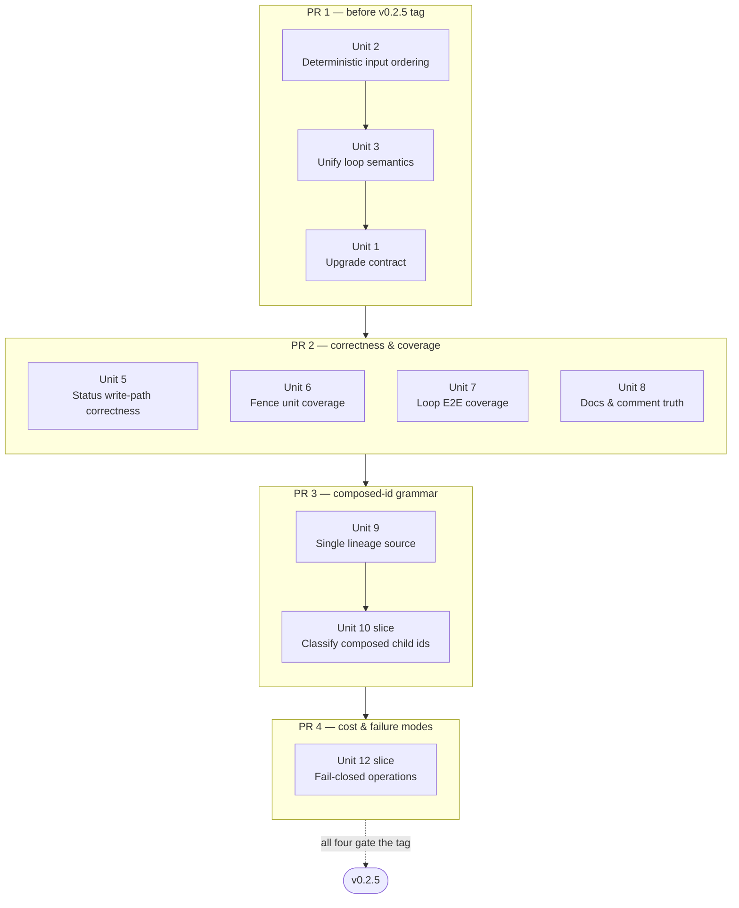
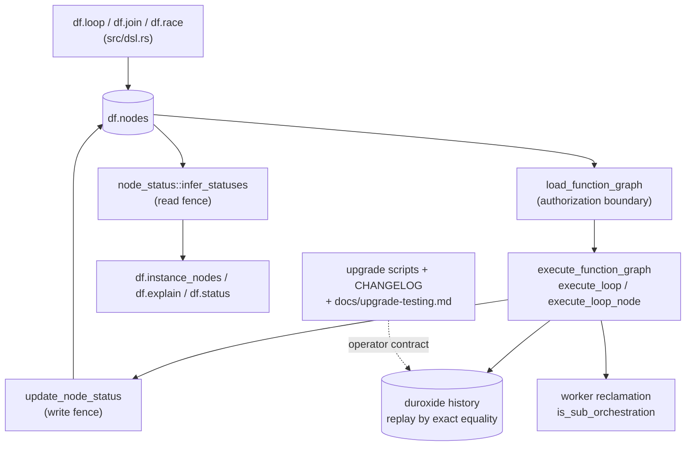

# fix: PR #228 review follow-ups — loop child sub-orchestrations

## Overview

PR #228 ("Fix df.loop with child sub-orchestrations", merged as `1320f65`) moved non-root
`df.loop()` nodes into dedicated `execute_loop` child sub-orchestrations and rewrote the
node-status write fence to compare full stamp lineages. A multi-persona review of the merged
diff produced 43 findings. This plan sequences the actionable subset into **four**
pull requests.

The plan is organized around one hard constraint discovered during planning:

**v0.2.5 is not yet tagged.** The last release tag is `v0.2.4`; `Cargo.toml` says `0.2.5`;
`sql/pg_durable--0.2.4--0.2.5.sql` is still an open, editable upgrade script; and
`CHANGELOG.md` already carries a `## [0.2.5] - Unreleased` section. Everything about the
0.2.5 upgrade contract is therefore still cheap to fix — and every *replay-breaking* change
we intend to make should land before the tag, because 0.2.5 already declares a
history-shape break and shipping a second one in 0.2.6 would force operators to drain
in-flight instances twice.

That constraint, plus two natural cohesion lines, gives four PRs:

| PR | Theme | Gate |
|---|---|---|
| 1 | **The 0.2.5 release contract** — upgrade guidance plus the proven replay-breaking fixes | Must merge **before** `v0.2.5` is tagged |
| 2 | **Make the claims true** — terminal-status correctness, missing tests, and stale docs | Must merge **before** `v0.2.5` is tagged |
| 3 | **One composed-id grammar** — typed stamp/instance-id parsing plus reclamation classification | Must merge **before** `v0.2.5` is tagged |
| 4 | **Fail closed operationally** — rate limiting, status-write failures, and replay-failure reconciliation | Must merge **before** `v0.2.5` is tagged |

PR 1 contains Units 1-3. Units 2 and 3 change duroxide's recorded history shape, while Unit
1 documents their combined release contract. Unit 4's history-growth problem remains real,
but its state-preservation design is unresolved; it is deferred rather than allowed to block
the release. All four PRs merge before the tag because PR 4 may also change orchestration
syscall ordering. Operators therefore perform one conservative drain across the complete
change set.

Each PR below lists an internal **commit sequence**. The commits are the review unit; the PR
is the merge unit.

## Problem Frame

PR #228 delivers a design that was already agreed: issue #227's design note prescribes
exactly this architecture, and a parked prior attempt exists on
`origin/pinodeca/after-duroxide-31-merges` (commits `754f1f2`, `3a4255f`). The blocker was
upstream, and `duroxide 0.1.30` (merged in #305, the commit immediately before #228) cleared
it. The core approach is sound and #233 is genuinely fixed with strong tests.

What the review surfaced is not a design problem but a **finishing** problem, in four
clusters:

1. **The upgrade contract is filed against the wrong release.** The drain-before-upgrade
   warning was added to `sql/pg_durable--0.2.3--0.2.4.sql`, which shipped with `v0.2.4` on
   2026-07-02. Operators upgrading 0.2.4 → 0.2.5 never re-execute that file, and the file
   they *do* read says nothing about the break. There is no `docs/upgrade-testing.md` entry
   and no CHANGELOG entry for the loop change.

2. **Root and non-root loops have silently diverged.** `run_loop_iteration` catches
   `NodeError::Break` from a while-condition node and exits the loop normally;
   `execute_loop_node` uses a bare `?` and lets the Break escape to `execute()`, which fails
   the whole instance with "df.break() was called outside of a loop". Identical DSL, opposite
   outcomes, decided purely by whether a prefix node happens to exist. This is the ~90 lines
   of duplicated loop policy having already drifted, in the same PR that created it.

3. **The regression coverage does not match the claims.** The PR says "Closes #230", but both
   tests in `tests/e2e/sql/56_loop_contains_join_race.sql` wrap the loop in
   `df.seq(prefix, df.loop(...))`, making it non-root and routing it through the new child
   path. #230's reported repro is a **root** loop containing a JOIN — which this PR
   deliberately leaves on the old inline path. Separately, the new recursive
   `node_status::is_superseded` has zero unit tests, and no test anywhere exercises a
   failing loop, a losing-RACE loop, or a nested loop.

4. **Each generation now costs more than it did.** `execute_loop` reloads the full function
   graph every generation, re-serializes the entire accumulated `results` map into every
   `continue_as_new` input, and each generation spawns a fresh durable child instance that
   nothing reclaims until the root ages past retention. Independently, `results` and
   `ExecutionContext.vars` are `HashMap<String, String>`, whose serialization order is
   unstable — and duroxide matches recorded inputs by exact string equality.

## Requirements Trace

- **R1.** An operator upgrading from 0.2.4 to 0.2.5 must learn about the replay break from
  artifacts they actually read: `sql/pg_durable--0.2.4--0.2.5.sql`, `CHANGELOG.md`, and
  `docs/upgrade-testing.md`, including an executable all-tenant drain runbook.
- **R2.** No already-shipped upgrade script may carry claims about a later release.
- **R3.** `df.break()` inside a while-condition must behave identically whether the loop is
  the graph root or nested.
- **R4.** Every replay-breaking change intended for this line must land before `v0.2.5` is
  tagged, so operators drain once rather than twice.
- **R5.** Regression tests must reproduce the shape of the issue they claim to close.
- **R6.** The read-side and write-side supersession rules must be tested and must not
  silently disagree.
- **R7.** Loop-child instances must not block orphan reclamation, loop rate limiting must
  fail closed, and replay failures must become terminal and observable.
- **R8.** Scenario B1 (new `.so` against all prior schemas within the major line) must
  remain intact for every change that touches schema-dependent behavior.

## Scope Boundaries

- **Not reverting PR #228.** The design is correct and matches the #227 design note.
- **Not introducing orchestration versioning.** The project has explicitly accepted replay
  breaks at this pre-1.0 stage (see the 0.2.4 CHANGELOG rationale). This plan works within
  that decision rather than relitigating it.
- **Not moving root loops onto the child path.** Whether root loops should also become
  child orchestrations is a real design question, but it is out of scope here; Unit 3
  unifies *semantics* without unifying *execution model*. The retained split is deliberate:
  migrating root loops would expand the replay and lifecycle surface beyond the known defect.
- **Not addressing the #154 signals-in-sub-orchestrations race.** A `df.wait_for_signal()`
  inside a non-root loop body now inherits that known limitation. Recorded as a risk;
  fixing #154 is separate work.
- **Not fixing pre-existing issues unrelated to loops** unless PR #228 materially widened
  their blast radius (which is why `is_sub_orchestration` and the rate-limiter fail-open
  *are* in scope).
- **Not redesigning loop history persistence in this release.** Unit 4's accumulated-result
  growth needs a state model with precise visibility semantics and a measurable storage
  bound; it remains documented research rather than release-gated implementation.
- **Not performing unmeasured hot-path optimization.** Unit 11's CAS, graph-load, schema
  cache, and inference changes are deferred until independently measured and designed.
- Security review found no exploitable issues in this diff; no security-remediation unit
  is required.

## Context & Research

### Release state (verified 2026-07-29)

| Fact | Value |
|---|---|
| `main` HEAD | `1320f65` — "Fix df.loop with child sub-orchestrations (#228)" |
| Preceding commit | `461e46e` — "chore(deps): bump duroxide to 0.1.30 (#305)" |
| `Cargo.toml` version | `0.2.5` |
| Latest git tag | `v0.2.4` — **0.2.5 is unreleased** |
| Open upgrade script | `sql/pg_durable--0.2.4--0.2.5.sql` (currently documents only `df.http_multipart()`) |
| CHANGELOG | `## [0.2.5] - Unreleased` section exists; has no loop entry |
| `docs/upgrade-testing.md` | `### v0.2.4 → v0.2.5` heading exists with one subsection |

### Relevant code and patterns

- `src/orchestrations/execute_function_graph.rs` — `execute_loop` (registered entry point,
  runs one generation), `run_loop_iteration` (body + while-condition),
  `execute_loop_node` (root-only inline handler), `execute_loop_suborchestration` (spawner),
  `branch_child_orchestration` (JOIN/RACE branch dispatch), `stamp_loop_node`,
  `loop_exit_envelope`.
- `src/activities/update_node_status.rs` — `stamp_lineage`, `incoming_stamp_is_superseded`,
  `push_status_update`, `status_details_present`, and the new
  `begin → SELECT ... FOR UPDATE → UPDATE → commit` fence.
- `src/node_status.rs` — `stamp_of`, recursive `is_superseded`, `infer_statuses`,
  `child_max_gen_anc`.
- `src/types.rs:995` — `ExecutionContext.vars: HashMap<String, String>`. Contrast with
  `FunctionGraph::nodes`, which is already a `BTreeMap` with the comment *"required for
  Duroxide replay"* — the precedent this plan follows in Unit 2.
- `src/worker.rs:171` — comment recording a past pool-starvation incident that forced a
  dedicated 1-connection polling pool. Grounds the caution in Unit 11.
- `src/worker.rs:903` — `is_sub_orchestration` matches only the `sub::` prefix.

### Precedents to mirror

- **CHANGELOG replay-break callout:** the `[0.2.4]` entry's
  `> ⚠️ **Replay-breaking for in-flight ... instances.**` block is the exact template for
  Unit 1's CHANGELOG addition.
- **Upgrade-testing drain contract:** the `#129` section at `docs/upgrade-testing.md:239`
  is the template for the new `v0.2.4 → v0.2.5` subsection.
- **Deprecation rename:** `docs/upgrade-testing.md:224` already documents
  `df.wait_for_completion()` → `df.await_instance()`; `src/dsl.rs:1361` emits a runtime
  `WARNING`. 33 of 37 E2E files already use the new name.

### Institutional learnings

- `docs/DUROXIDE_PG_DEADLOCK_ISSUE.md` — the recorded deadlock is on
  `duroxide.instance_locks` inside the provider, **not** `df.nodes`. The new `FOR UPDATE` is
  a single-row PK lock with no nested acquisition, so it is not a re-entry of that bug — and
  the document's own recommended remedy was `SELECT FOR UPDATE`. Two deltas remain: this
  code uses blocking `FOR UPDATE` rather than `SKIP LOCKED`, and adds no serialization
  retry.
- `docs/security-review/security-review.md:152` (D-5) — the small management pool is a
  **deliberate** DoS mitigation. Unit 11 must not "fix" contention by enlarging it.
- `docs/upgrade-testing.md:243` (#129) — establishes the drain-before-upgrade contract this
  release re-invokes.
- `CHANGELOG.md:143` (#154) — signals raised before a sub-orchestration reaches `Running`
  are not redelivered. Non-root loop bodies now live in a child orchestration and inherit
  this race.

## Key Technical Decisions

- **Sequence by replay-break window, not by severity.** The single most schedule-sensitive
  property is that duroxide replays by exact equality on recorded inputs and instance ids.
  Any change to activity input shape, orchestration input JSON, or scheduling order forces
  a drain. 0.2.5 already forces one. Putting every such change in PR 1 converts four
  separate operator drains into one. This is why the `BTreeMap` and shared-loop-policy
  changes outrank several higher-severity findings in the ordering.

- **Group by drain boundary and by shared grammar, not by finding severity.** The natural
  seams in this work are not P1-vs-P2. They are: what must ship together to avoid a second
  drain (PR 1); what makes the repo's claims match its behaviour (PR 2); what parses the
  composed-id grammar (PR 3); and what costs time or fails open (PR 4). `is_sub_orchestration`
  is a good illustration — by severity it is an unremarkable P2, but it is *literally a
  composed-id parser*, so it belongs beside `stamp_lineage` in PR 3 rather than in a
  reliability grab-bag.

- **Fix the upgrade contract by moving the note, not by re-releasing 0.2.4.** Because
  `v0.2.5` is untagged, the correct remedy is a three-line revert in
  `sql/pg_durable--0.2.3--0.2.4.sql` plus an equivalent block in the open
  `sql/pg_durable--0.2.4--0.2.5.sql`. No re-release, no superseding script, no operator
  action. Had 0.2.5 already shipped this would have been materially harder — which is the
  argument for doing it first.

- **Unify loop semantics by delegation, not by duplication-with-a-patch.** The narrow fix
  for the `df.break()` divergence is to add a `Break` catch to `execute_loop_node`. The
  better fix is to make `execute_loop_node` call `run_loop_iteration`, because the
  divergence exists *at all* only because ~90 lines of loop policy were copied. Patching
  one symptom leaves the break-catch, while-condition, `MAX_LOOP_ITERATIONS` guard, and the
  byte-identical `LOOP_MIN_ITER_DURATION` block free to drift again.

- **`BTreeMap` over sorted-key serialization helpers.** `results` and `vars` could be given
  a custom serializer that sorts keys. Changing the type instead makes the ordering property
  hold by construction everywhere the maps are serialized — currently six call sites — and
  matches the existing `FunctionGraph::nodes` precedent. The cost is touching many
  signatures; the benefit is that a future seventh call site cannot regress.

- **Test the true #230 repro before deciding whether #230 needs a code fix.** #263 introduced
  composed child instance ids that already vary by the parent's `execution_id`, so a root
  loop's JOIN branches may already get distinct ids per iteration — meaning #230 could be
  fixed and merely untested. Unit 7 writes the test first; only if it fails does a code fix
  get scheduled. Guessing in either direction now would waste work.

- **Keep root loops on the inline path for now.** Unifying the *execution model* (making
  root loops child orchestrations too) would delete the divergence permanently but is a
  much larger replay-breaking change with its own instance-lifecycle questions. Unifying
  *semantics* via shared code achieves R3 at a fraction of the risk.

- **Conservative drain plus reconciliation.** The combined changes affect non-root loops,
  root loops, and replay-recorded JOIN/RACE inputs, so shape-specific detection is unsafe.
  PR 1 documents an administrative, all-tenant drain of every non-terminal instance; PR 4
  adds terminal reconciliation for engine failures that would otherwise remain `running`.

## Open Questions

### Resolved during planning

- *Is 0.2.5 shipped, and does that force a 0.2.6 upgrade script?* — No. Last tag is `v0.2.4`;
  `sql/pg_durable--0.2.4--0.2.5.sql` is open. Verified via `git tag --list` and `ls sql/`.
- *Does the CHANGELOG need a new `[0.2.5]` section?* — No, it exists and is `Unreleased`;
  it needs a loop entry added to it.
- *Does `docs/upgrade-testing.md` need a new version heading?* — No, `### v0.2.4 → v0.2.5`
  exists at line 206 with one subsection; it needs a sibling subsection.
- *Is the `sql/pg_durable--0.2.3--0.2.4.sql` change DDL or comment?* — Comment only. Verified
  via `git show 1320f65 -- sql/pg_durable--0.2.3--0.2.4.sql`: eleven lines changed, all
  inside a `--` comment block; the `ALTER TABLE df.nodes ADD COLUMN status_details JSONB;`
  statement is untouched. Reverting it therefore cannot affect Scenario A schema comparison
  or the pgspot gate.
- *Does cancellation reach the loop child?* — Yes. duroxide enqueues `CancelInstance` for
  outstanding sub-orchestrations and passes explicit child ids verbatim. This is a
  documentation gap, not a functional one.
- *Does the review contain security remediation work?* — No. All five security probes came
  back clean; the single P3 note (`df.nodes.id` has no format `CHECK`) is pre-existing and
  RLS-confined.

### Deferred to implementation

- **Whether the true #230 repro passes on current `main`.** Unit 7 answers this empirically.
  If it fails, PR 2 stops while the smallest fix is identified and classified; any
  replay-breaking correction moves into PR 1 before its release documentation is finalized.
- **Whether `execute_loop_node` can fully delegate to `run_loop_iteration`, or only share
  extracted helpers.** The two differ in how they surface the loop result (`Ok(body_result)`
  vs. `Ok(Some(..))` envelope) and in `exec_ctx.loop_iteration` ownership. Full delegation is
  the goal; the fallback is extracting the four policy blocks into shared functions. Which is
  achievable is only knowable once the signatures are in front of you.
- **Bounded loop-history state (Deferred Unit 4).** Named-result visibility and a durable
  persistence model need a separate design; no runtime change is part of this release.
- **Hot-path optimization (Deferred Unit 11).** CAS semantics, authorization freshness, and
  schema-capability invalidation require measurement and a separate plan.
- **Child retention and cumulative iteration budgets.** PR 3 fixes only reclamation-batch
  classification. Eager pruning and nested-budget policy remain separate design work.

## High-Level Technical Design

> *This illustrates the intended approach and is directional guidance for review, not
> implementation specification. The implementing agent should treat it as context, not code
> to reproduce.*

Where the loop divergence lives today, and what Unit 3 collapses:

```text
                      execute_node_inner  dispatches "loop"
                                  |
             +--------------------+--------------------+
             |                                         |
    node_id == root_node_id                    node_id != root_node_id
             |                                         |
             v                                         v
    execute_loop_node                    execute_loop_suborchestration
    (inline, in parent history)            (spawns child instance)
             |                                         |
             |                                         v
             |                                  execute_loop  <--+
             |                                         |         | continue_as_new
             |                                         v         |
             |                                 run_loop_iteration|
             |                                         +---------+
             |                                         |
    +--------+--------+                       +---------+---------+
    | break-catch     |  <-- DIVERGED -->     | break-catch       |
    | while-condition |  <-- duplicated -->   | while-condition   |
    | MAX_ITERATIONS  |  <-- duplicated -->   | MAX_ITERATIONS    |
    | MIN_ITER_DUR    |  <-- byte-identical-> | MIN_ITER_DUR      |
    +-----------------+                       +-------------------+

    Unit 3 target: the left column's four blocks are deleted and
    execute_loop_node delegates to the shared implementation.
    The execution-model split (inline vs. child) is retained.
```

Stamp lineage, the grammar both fence sides parse:

```text
    {root_instance} :: {gen} :: {node} :: {gen} :: ... :: {node} :: {gen}
     \_____________/    \___/   \____/
       token[0]        odd idx   even idx >= 2
                       = generation  = branch node id

    Always an even token count for stamps this binary emits.
    Write side: stamp_lineage()  -> requires even count, else None -> FENCE OFF
    Read side:  stamp_of() + is_superseded() -> different validity rules

    Unit 9 target: one parser, one supersession predicate, shared by both sides,
    with the None path observable rather than silently permissive.
```

## Implementation Units

The work is described as implementation units because that is the granularity at which it
can be reasoned about and reviewed. It **ships as four pull requests**. Units 4 and 11 are
retained as deferred research records and do not ship in these PRs. Each active unit becomes
one or more commits inside its PR; all four PRs together form the release drain boundary.

| PR | Units | Theme |
|---|---|---|
| **PR 1** | 1, 2, 3 | The 0.2.5 release contract |
| **PR 2** | 5, 6, 7, 8 | Make the claims true |
| **PR 3** | 9 + reclamation-classification slice of 10 | One composed-id grammar |
| **PR 4** | Operational slice of 12 | Fail closed operationally |



  PRs 3 and 4 have no ordering constraint between them and may proceed concurrently after
  PR 2. The arrow records the recommended default; the tag waits for both.

---

### PR 1 — The 0.2.5 release contract

**Why these three together:** Units 2 and 3 change the shape of what duroxide records and
replays. Unit 1 is the operator-facing description of that combined break, so it belongs in
the same commit range as the break it documents. The CHANGELOG entry and upgrade runbook are
written once, after the runtime behavior is final.

**Commit sequence:** Unit 2 → Unit 3 → Unit 1. Unit 1's documentation is written last
so it describes the final shipped behaviour rather than an intermediate state.

**Merge gate:** This PR must merge before `v0.2.5` is tagged.

---

- [x] **Unit 1: Correct the v0.2.5 upgrade contract**

**Goal:** Make the drain-before-upgrade requirement visible to the operators who need it —
those upgrading 0.2.4 → 0.2.5 — and remove the claim from the shipped 0.2.4 script.

**Requirements:** R1, R2

**Dependencies:** None. Commit last within PR 1; PR 1 gates the `v0.2.5` tag.

**Files:**
- Modify: `sql/pg_durable--0.2.3--0.2.4.sql` (revert the loop paragraph added by `1320f65`,
  restoring the four original lines)
- Modify: `sql/pg_durable--0.2.4--0.2.5.sql` (add an upgrade-ordering comment block)
- Modify: `docs/upgrade-testing.md` (new subsection under `### v0.2.4 → v0.2.5`)
- Modify: `CHANGELOG.md` (entry under `## [0.2.5] - Unreleased`)
- Test: no new test file — verified by `scripts/test-upgrade.sh`

**Approach:**
- The 0.2.3→0.2.4 change is comment-only and sits above an untouched
  `ALTER TABLE df.nodes ADD COLUMN status_details JSONB;`. Reverting the comment cannot
  affect Scenario A schema comparison or the pgspot gate.
- The new `docs/upgrade-testing.md` subsection should state: what changed in history shape
  (non-root loops now run as child sub-orchestrations with composed instance ids; the loop
  node is stamped by the child, not the parent); that no DDL is required because
  `status_details` already exists as of 0.2.4; the B1 position (the new `.so` still runs
  against ≤ 0.2.3 schemas with the fence inert — see Unit 5's note); and the drain
  requirement.
- Include a complete operator runbook: quiesce new `df.start()` submissions; connect as the
  documented administrative role that can see every tenant despite `nodes_user_isolation`;
  list all non-terminal instances with a static, schema-qualified query; wait to a declared
  maintenance timeout; cancel or defer the upgrade for workflows that do not finish; verify
  zero non-terminal rows; apply the extension update; restart/verify the worker; and confirm
  status and scheduling health. Tenant-scoped roles are explicitly insufficient because RLS
  can make a partial result look like a successful drain.
- The CHANGELOG entry should mirror the `[0.2.4]` blockquote format, including the
  `> ⚠️ **Replay-breaking for in-flight ... instances.**` callout. Require draining all
  in-flight instances: Unit 2 affects replay-recorded JOIN/RACE inputs and Unit 3 changes
  root-loop scheduling, so a non-root-loop-only query would understate the blast radius.
- Add a sentence noting that on pre-0.2.4 schemas (`status_details` absent) the write fence
  is inert *and* this release widens the writer set, because `stamp_loop_node` re-stamps the
  loop node every generation — so loop-node status on un-upgraded schemas is best-effort.

**Patterns to follow:**
- `CHANGELOG.md` `[0.2.4] → Changed → df.wait_for_schedule()` blockquote.
- `docs/upgrade-testing.md` `#### #129 Promote df.nodes to a composite primary key`.

**Test scenarios:**
- Integration: `scripts/test-upgrade.sh` passes — Scenario A fresh-install-vs-upgrade-chain
  schema comparison is byte-identical to before this unit, confirming the reverted comment
  had no schema effect.
- Integration: the pgspot gate (`scripts/pgspot-gate.sh`) passes on both modified upgrade
  scripts.
- Happy path: the administrative query sees in-flight instances submitted by multiple roles,
  including root loops, non-root loops, and JOIN/RACE graphs.
- Security: the same query under a tenant role returns only that tenant's rows, proving why
  the administrative execution-role requirement is necessary.
- Edge case: the drain query returns zero rows on a database whose instances are all
  terminal.

**Verification:**
- `git show 1320f65 -- sql/pg_durable--0.2.3--0.2.4.sql` reversed cleanly; that file is
  byte-identical to its `v0.2.4` tagged state.
- A reader of only `sql/pg_durable--0.2.4--0.2.5.sql` and `CHANGELOG.md` learns they must
  drain all in-flight instances and where to find the executable runbook.
- `docs/upgrade-testing.md` `### v0.2.4 → v0.2.5` has a subsection for the loop change.

---

- [x] **Unit 2: Deterministic ordering for replay-recorded orchestration inputs**

**Goal:** Make `results` and `vars` serialize in a stable order so duroxide's exact-equality
input matching cannot fail on replay.

**Requirements:** R4, R8

**Dependencies:** None. Commit before Unit 3 to avoid rebasing the same signatures twice.

**Files:**
- Modify: `src/types.rs` (`ExecutionContext.vars` at ~line 995, and the `results`/`vars`
  parameters on the substitution helpers at ~745, 846-888, 946)
- Modify: `src/orchestrations/execute_function_graph.rs` (the `results` maps and every
  serialization site: ~923, ~1097-1098, ~1377-1380, ~1488-1491)
- Test: `src/types.rs` test module (the `make_results` / `empty_vars` builders at ~1668)
- Test: `tests/e2e/sql/58_loop_child_result_ordering.sql` (new)

**Approach:**
- Change `HashMap<String, String>` to `BTreeMap<String, String>` for `results` and for
  `ExecutionContext.vars` throughout. `BTreeMap` serializes in key order by construction, so
  the property holds at every present and future serialization site.
- This is the same reasoning already applied to `FunctionGraph::nodes`, which carries the
  comment *"required for Duroxide replay"* — cite it in the PR description as precedent.
- This is a **replay-breaking** change for any in-flight instance with two or more
  accumulated results, since the recorded input string changes. It must be inside the 0.2.5
  window; fold a line into the Unit 1 CHANGELOG entry rather than declaring a second break.
- The pre-existing exposure is `execute_join_node` / `execute_race_node`; PR #228 added
  three more call sites on the default non-root-loop path, which is what promotes this from
  latent to likely.

**Patterns to follow:**
- `src/types.rs` — `FunctionGraph::nodes: BTreeMap<...>` and its replay comment.

**Test scenarios:**
- Happy path: a graph accumulating five distinct named results, then entering a non-root
  loop, produces a byte-identical serialized `results` string across two independent
  process invocations.
- Edge case: an empty `results` map and an empty `vars` map serialize to `{}` unchanged.
- Edge case: a single-entry map is unaffected (guards against the change being a no-op only
  for the trivial case that already worked).
- Integration: a JOIN whose two branches each produce a named result, feeding a non-root
  loop that reads both — exercises the pre-existing join/race sites and the new loop sites
  in one graph.
- Integration: full existing E2E suite passes, confirming no substitution behaviour changed
  as a side effect of the map type.

**Verification:**
- No `HashMap` remains in any type whose value reaches `serde_json::to_string` on a path
  that feeds `schedule_sub_orchestration_with_id`, `schedule_activity`, or
  `continue_as_new`.
- Repeated runs of the same workflow produce identical recorded input strings.

---

- [x] **Unit 3: Unify root and non-root loop semantics**

**Goal:** Make `df.break()` in a while-condition behave identically at root and non-root
position, by deleting the duplicated loop policy rather than patching one copy.

**Requirements:** R3, R4

**Dependencies:** Unit 2 (both touch the same signatures; sequencing avoids a rebase).

**Files:**
- Modify: `src/orchestrations/execute_function_graph.rs`
- Test: `tests/e2e/sql/59_break_in_loop_condition.sql` (new)
- Test: `src/orchestrations/execute_function_graph.rs` test module

**Approach:**
- Today `run_loop_iteration` matches `Err(NodeError::Break(v))` from the condition node and
  returns `Ok(Some(v))`, while `execute_loop_node` uses a bare `.await?` so the `Break`
  propagates out to `execute()` and is converted into
  `"df.break() was called outside of a loop"`. Verified directly in the source.
- Preferred shape: `execute_loop_node` delegates its per-iteration work to
  `run_loop_iteration`, retaining only the root-specific concerns (inline
  `continue_as_new` on the parent, `exec_ctx.loop_iteration` ownership, returning a bare
  result rather than a `SubtreeControl` envelope). Fallback if the return shapes resist
  unification: extract the four policy blocks — break-catch, while-condition evaluation,
  `MAX_LOOP_ITERATIONS`, `LOOP_MIN_ITER_DURATION` — into shared helpers and call them from
  both paths. Note the rate-limit block is currently **byte-identical** between the two,
  so it is the easiest to extract and a good first move.
- Add `debug_assert_eq!(node_id, graph.root_node_id, ...)` at the top of
  `execute_loop_node`. Its root-only precondition is currently enforced ~580 lines away by
  an interception in `execute_function_node_with_vars`, and `execute_node_inner` still
  dispatches `"loop"` unconditionally — so a future edit could silently reintroduce #227.
- Keep the change limited to shared loop policy and the root-only precondition. Function
  renames, constant placement, branch return types, and input-JSON cleanup are unrelated
  maintenance and remain out of this PR.
- Changes scheduling order, so **replay-breaking** — PR 1.

**Execution note:** Start with a failing E2E for the root-loop break-in-condition case; the
divergence is the specification.

**Test scenarios:**
- Happy path: `df.loop('SELECT 1', 'SELECT 1' ~> df.break('done'))` (root position)
  completes with result `done`. This currently fails with
  "df.break() was called outside of a loop".
- Happy path: `'SELECT 1' ~> df.loop('SELECT 1', 'SELECT 1' ~> df.break('done'))` (non-root)
  completes with result `done` — the currently-passing side, asserted to prevent regression.
- Integration: the two graphs above produce the *same* terminal status and the same loop-node
  result, asserted in one test so divergence cannot reappear silently.
- Edge case: `df.break()` in a loop **body** (not condition) still exits both root and
  non-root loops normally.
- Edge case: `df.break()` with no enclosing loop at all still fails with the
  "outside of a loop" message — the error path must not be deleted along with the
  divergence.
- Error path: a malformed while-condition config still fails the loop rather than looping
  forever, at both positions (the M8 guard exists in both copies today and must survive
  consolidation).
- Error path: `MAX_LOOP_ITERATIONS` still trips at both positions.
- Integration: the loop rate-limit floor still applies at both positions after extraction.

**Verification:**
- The break-catch, while-condition, iteration-cap, and rate-limit logic each exist exactly
  once in the file.
- No E2E in `tests/e2e/sql/` regresses.

---

- [ ] **Deferred Unit 4: Design bounded loop-history state**

**Goal:** Produce an implementable state-preservation design and quantitative history bound
for long-running non-root loops. This unit is research only and does not ship in PR 1.

**Requirements:** Deferred follow-up to R7

**Dependencies:** None for the release. Re-plan as a future replay-breaking change.

**Files:**
- Research: duroxide history storage/query surface and named-result substitution semantics
- Prototype/Test: deterministic history-size benchmark with an explicit byte bound

**Approach:**
- `execute_loop` re-serializes the entire accumulated `results` map into every
  `continue_as_new` input, persisted once per generation. The **root** loop path does not do
  this. With `MAX_LOOP_ITERATIONS` at 100,000 and a sizeable named result, this reaches
  GB-scale history for a single instance. `prune_executions` is not called anywhere in
  `src/`.
- Named results are load-bearing across child generations and at the parent/child envelope;
  simply removing the map, or carrying referenced keys repeatedly, does not establish the
  required bound. The design must choose bounded external state, an explicit semantic
  restriction, or a compact delta/checkpoint protocol.
- Inventory every substitution surface and define exact visibility into, within, and out of
  the loop before proposing implementation.
- Identify the duroxide table/API used to measure history bytes and set a numerical bound as
  payload size and iteration count vary.

**Test scenarios:**
- Happy path: a non-root loop running 50 iterations completes with the same final result as
  before the change.
- Integration: a named result produced by a node **before** the loop is readable from inside
  the loop body — the scenario that determines whether results must be carried.
- Integration: a named result produced **inside** the loop body on iteration 1 is readable on
  iteration 2 — cross-generation accumulation within the child.
- Integration: a named result produced inside the loop is visible to a node **after** the
  loop in the parent graph, proving the exit envelope still merges results outward. (This is
  presently untested in any direction and is the highest-risk regression for this unit.)
- Edge case: a loop whose body produces a large result (≥ 1 MB) run for 20 iterations does
  not grow duroxide history proportionally to iterations × result size.

**Verification:**
- A follow-up plan names the persistence model, replay impact, visibility semantics, failure
  behavior, storage measurement source, and quantitative growth bound.
- No runtime code changes under this unit before that design is approved.

---

### PR 2 — Make the claims true

**Why these four together:** This PR closes the gap between what the repo asserts and what it
does. Unit 5 makes the loop node actually reach a terminal status, which is the precondition
for Units 6 and 7 being able to assert on it. Unit 7 includes the empirical test of whether
issue #230 is genuinely fixed — the single most important open question in this plan. Unit 8
rewrites the comments and docs that Units 5 and 7 falsify. Splitting the tests from the fix
they cover, or from the docs describing them, produces PRs that each land in a state where
some artifact in the repo is wrong.

**Commit sequence:** Unit 5 → Unit 6 → Unit 7 → Unit 8. Within Unit 6, fix the `gen()` builder
doc before writing the nested cases. Within Unit 7, write the #230 repro first and record
whether it passes on current `main` before changing any code.

**Merge gate:** Must merge before `v0.2.5` is tagged. The #230 reproduction runs first; if it
fails, classify the fix for replay impact and move any replay-breaking correction into PR 1.

---

- [ ] **Unit 5: Node-status write-path correctness**

**Goal:** Ensure the loop node always reaches a terminal status, and tighten two small
correctness edges in the status writer.

**Requirements:** R6, R8

**Dependencies:** None (independent of PR 1's units, but rebases onto Unit 3).

**Files:**
- Modify: `src/orchestrations/execute_function_graph.rs`
  (`execute_loop_suborchestration`, `execute_loop` early returns)
- Modify: `src/activities/update_node_status.rs` (fenced early-return path; the
  `result = NULL` guard)
- Test: `src/activities/update_node_status.rs` test module
- Test: `tests/e2e/sql/61_loop_child_start_failure.sql` (new)

**Approach:**
- The parent now intercepts loop nodes *before* stamping and hands ownership to the child.
  Several paths return without any stamp: `execute_loop_suborchestration`'s no-body guard,
  both serialization guards, the `schedule_sub_orchestration_with_id` error, and every
  `execute_loop` early return that precedes `execution_stamp` computation
  (`load_function_graph` failure, "Loop node not found", input-parse failures). The result
  is a `pending` loop node on a `failed` instance in `df.explain()`, which read-side
  inference will not repair.
- Give the ownership handoff an explicit contract: either the parent stamps before handing
  off and the child overwrites, or the parent stamps `failed` on every path where the child
  provably never started. The latter is narrower and preferred. The child owns failures only
  after it has validated `instance_id` and `loop_node_id`; malformed input without recoverable
  node identity is an instance-level failure handled by PR 4 reconciliation.
- Define cancellation ownership explicitly: when a loop child is cancelled as a losing RACE
  branch, the parent/fence-aware cancellation path stamps the loop node terminal. Do not
  document a `running` node under a terminal parent as acceptable behavior.
- Add an explicit `tx.rollback()` on the fenced early-return path. Today the transaction is
  left open and the `FOR UPDATE` lock is released by sqlx's drop-rollback, which only
  *queues* the ROLLBACK — and on the BGW's `new_current_thread` runtime it is not flushed
  until the scheduler next yields. This is the RACE-loser drain path, where contention is
  likeliest.
- Change the `result = NULL` guard from an exact `status == "running"` literal to
  `!matches!(status, "completed" | "failed")`. `nodes_status_chk` also admits `'pending'`,
  so a future non-terminal status would violate `nodes_result_status_chk` as an opaque
  activity failure.

**Test scenarios:**
- Error path: a loop node whose body is missing leaves the loop node `failed`, not `pending`,
  and the instance reports a message naming the loop node.
- Error path: `load_function_graph` failing inside `execute_loop` leaves the loop node in a
  terminal status.
- Integration: `df.explain()` on a failed instance containing a non-root loop shows no
  `pending` loop node.
- Happy path: the normal completion path still stamps `completed` exactly once, with the
  child's stamp winning over any parent stamp.
- Unit: the fenced-reject path returns `Ok(...)` and releases its row lock before returning
  — assert via a second concurrent writer acquiring the same row without blocking.
- Unit: a status of `pending` with a non-null result is rejected by the guard rather than
  reaching the database and tripping `nodes_result_status_chk`.
- Edge case (B1): with `status_details` absent, all of the above still behave as they did
  before this unit — the fence is inert but no path panics or errors.

**Verification:**
- Every path with recoverable loop-node identity, including cancellation, leaves that node
  terminal. Unidentifiable malformed child input becomes terminal at the instance level via
  PR 4 reconciliation.
- `scripts/test-upgrade.sh` still passes (B1 unaffected).

---

- [ ] **Unit 6: Unit coverage for the stamp fence and lineage parser**

**Goal:** Test the read-side supersession walk and the parser edge cases the write side
depends on.

**Requirements:** R6

**Dependencies:** None.

**Files:**
- Test: `src/node_status.rs` test module
- Test: `src/activities/update_node_status.rs` test module

**Approach:**
- `node_status::is_superseded`'s recursive lineage walk has **zero** coverage. All 22
  existing fixtures use flat two-token stamps like `i::1`, which only reach the
  `tokens.len() < 3` early return — so the recursion this PR added is never entered by any
  test. Its write-side mirror received eight tests in the same PR.
- The existing test builder's `gen()` helper is documented as taking the "second
  `::`-token" but stores the whole stamp verbatim. Fix the doc first, or every nested-lineage
  test added here will be a silently-passing no-op.
- All eight new write-side tests compare **equal-depth** lineages (2v2, 4v4, 6v6). The
  parent-vs-child comparison this PR actually introduces — `root::1` against
  `root::1::loop::2` — is exactly the unequal-depth case, and it is untested.
- Document the current unequal-depth behaviour explicitly: when one lineage's node vector is
  exhausted at a tied generation, both directions return `false`, so parent and descendant
  scopes have no ordering and last-writer-wins. Whether to *change* that belongs to Unit 9;
  this unit pins it down so Unit 9 has a baseline.
- `stamp_lineage` returning `None` disables the fence entirely and silently. Three `None`
  paths exist; only the `"legacy"` one is tested. Odd token counts and non-numeric
  generations are uncovered, as is an unparseable *existing* stamp.

**Execution note:** Fix the `gen()` builder doc/behaviour before writing the nested cases.

**Test scenarios:**
- Happy path: `is_superseded` on a three-level lineage where an ancestor scope has advanced
  returns `true`.
- Happy path: `is_superseded` on a three-level lineage where no ancestor has advanced
  returns `false`.
- Edge case: sibling scopes at equal depth (`R::0::A::9` vs `R::0::B::0`) do not fence each
  other, in both directions.
- Edge case: unequal-depth pair `R::0` vs `R::0::L::7`, asserted in **both** directions, to
  pin the non-antisymmetric behaviour.
- Edge case: a loop child at generation 7 vs the same child at generation 8 — older fenced,
  newer accepted.
- Edge case: an abandoned prior-generation JOIN branch inside a loop
  (`R::0::L::3::B::0` vs `R::0::L::4`) is correctly fenced.
- Error path: `stamp_lineage` with an odd token count returns `None`.
- Error path: `stamp_lineage` with a non-numeric generation token returns `None`.
- Error path: an unparseable *existing* stamp in the database does not fence a well-formed
  incoming write.
- Edge case: a node id that happens to be all digits (roughly 1 in 43 of the 8-hex id space)
  is assigned to the node slot, not the generation slot — positional parsing must not be
  confused by a numerically-parseable node id.

**Verification:**
- Line coverage of `node_status::is_superseded` and `update_node_status::stamp_lineage`
  includes every branch.
- Every equal-depth case in the existing eight tests has an unequal-depth counterpart.

---

- [ ] **Unit 7: Close the loop-child E2E coverage gaps**

**Goal:** Test the shapes the PR claims to fix and the failure modes the new child boundary
introduces.

**Requirements:** R5

**Dependencies:** Unit 3 (break semantics must be settled before asserting them).

**Files:**
- Create: `tests/e2e/sql/62_root_loop_contains_join.sql`
- Create: `tests/e2e/sql/63_loop_branch_failure.sql`
- Create: `tests/e2e/sql/64_nested_loops.sql`
- Modify: `tests/e2e/sql/53_inferred_status.sql`
- Modify: `tests/e2e/sql/57_loop_in_join_race_branch.sql`
- Modify: `tests/e2e/sql/55_nonroot_loop.sql`

**Approach:**
- **The #230 repro.** Both tests in `56_loop_contains_join_race.sql` use
  `df.seq(prefix, df.loop(...))`, which is non-root and therefore exercises the *new* path.
  #230's reported shape is a **root** loop containing a JOIN, which PR #228 deliberately
  leaves on the inline path. The pre-existing `22_break_in_join_race.sql` breaks on
  iteration 1 specifically to avoid the bug. Write the root-loop-containing-JOIN test that
  crosses the ≥ 2 iteration boundary. It may pass — #263's composed child ids already vary by
  the parent's `execution_id` — in which case #230 was fixed earlier and merely untested. If
  it fails, stop PR 2, identify the controlling path, classify the smallest fix for replay
  impact, and move a replay-breaking fix into PR 1. PR 2 may not absorb an unknown scheduling
  change while claiming to be replay-safe.
- **Losing RACE branch.** No test covers a loop as the *losing* branch, i.e. cancellation of a
  live loop child. Cancellation does cascade (verified), but a cancelled loop child never runs
  its `failed` stamp, so assert what the loop node's status actually is under a cancelled
  instance and make that the documented contract.
- **Failure inside a loop branch.** All six tests added by PR #228 assert `completed`. Nothing
  tests a loop that *fails* inside a JOIN/RACE branch, so error propagation across the new
  child boundary is entirely unproven.
- **Nested loops.** Modelled in the new write-fence unit tests but constructed nowhere in
  E2E. This is also where the iteration-budget question in Unit 10 becomes observable.
- **Fix the vacuous assertion** in `53_inferred_status.sql`: `skipped_count >= 1` is satisfied
  by the break-IF's untaken `df.sleep(1)` ELSE arm, so it passes even if the node it targets
  infers `pending` — precisely the regression it claims to guard. Assert the specific node's
  inferred status.
- **De-hardcode the topology assertion** in `57_loop_in_join_race_branch.sql`, which builds
  its expectation as `v_id || '::1::' || v_loop_node` with a literal parent generation `1`
  and parses `status_details` with a hand-written regex. Any future root-level
  `continue_as_new` breaks it with no behavioural regression. Also tighten the
  distinct-scope count, which currently accepts a `[2,3]` range.
- **Named results out of the loop child** in `55_nonroot_loop.sql`: Test 3 covers only
  prefix → body, and Test 2's suffix is a bare `INSERT ... DEFAULT VALUES` consuming nothing,
  so results could be dropped on return and every test would still pass. (Overlaps Unit 4 —
  whichever lands first owns it.)

**Patterns to follow:**
- `tests/e2e/sql/57_loop_in_join_race_branch.sql` structure, but with `df.await_instance`
  and without hardcoded generation literals.
- The polling/timeout skeleton in `.github/copilot-instructions.md`.

**Test scenarios:**
- Happy path: root loop containing a JOIN, ≥ 3 iterations, completes with correct
  per-iteration side effects. *(This is the true #230 repro.)*
- Happy path: root loop containing a RACE, ≥ 3 iterations, completes.
- Error path: a non-root loop whose body fails on iteration 2 fails the parent instance with
  the body's error message surfacing, not a generic envelope error.
- Error path: a loop inside a JOIN branch fails; the sibling branch's outcome and the
  instance's terminal status are both asserted.
- Edge case: a loop as the losing RACE branch — the instance completes via the winner, and
  the loop node's status is asserted explicitly.
- Happy path: nested loops (outer 3 iterations × inner 2) produce 6 body executions in the
  correct order.
- Integration: a named result produced inside a loop child is readable by a node after the
  loop in the parent graph.
- Integration: `df.instance_nodes()` on a completed nested-loop instance reports no
  `pending` nodes.

**Verification:**
- Every issue the PR claims to close has a test reproducing that issue's actual shape.
- No assertion in the loop test suite can pass while the behaviour it names is broken.

---

- [ ] **Unit 8: Documentation and in-code comment truth**

**Goal:** Bring prose and comments into line with the shipped behaviour.

**Requirements:** R1

**Dependencies:** None. Last commit in PR 2, so it describes the finished state.

**Files:**
- Modify: `docs/ARCHITECTURE.md`
- Modify: `USER_GUIDE.md`
- Modify: `src/orchestrations/execute_function_graph.rs` (comments only)
- Modify: `src/activities/update_node_status.rs` (comments only)
- Modify: `src/node_status.rs` (test-builder doc)
- Modify: `tests/e2e/sql/53_inferred_status.sql`, `55_nonroot_loop.sql`,
  `56_loop_contains_join_race.sql`, `57_loop_in_join_race_branch.sql`

**Approach:**
- `docs/ARCHITECTURE.md` is stale in three concrete spots: the registry snippet omits
  `LOOP_NAME`; the text stating `execute_loop_node` "is the only handler that catches
  `NodeError::Break`" is now false (`run_loop_iteration` does too); and the "Loops and
  Continue-As-New" section documents only the inline model. `USER_GUIDE.md` and
  `docs/api-reference.md` *were* updated by PR #228, so this is an inconsistent omission
  rather than a blanket one.
- Five in-code comments still claim readers depend on the "second `::`-token". Both readers
  now parse the *last* token and walk the full lineage. `docs/api-reference.md` was corrected
  in the same diff, which proves the comments stale. Left alone they would lead a maintainer
  to reorder id segments believing only position 2 matters.
- `USER_GUIDE.md`'s new "How Loops Execute" section implies `@>` always yields a root loop.
  Per `docs/grammar.md`, `@>` is a general prefix operator, so `df.seq('SELECT 1', @> body)`
  is non-root. Root-ness is positional, not operator-determined.
- `USER_GUIDE.md`'s "Stopping a Loop Externally" predates the child model. Cancellation does
  cascade, so this is docs-only — but note that a cancelled loop child never runs its
  terminal stamp, leaving a `running` node under a `cancelled` instance (assert the real
  behaviour in Unit 7 first, then document what it actually does).
- Replace nine `df.wait_for_completion` call sites with `df.await_instance`. The old name
  emits a runtime `WARNING` and exists only as a pre-0.2.3 binary shim; 33 of the 37 E2E
  files already use the canonical name. `53_inferred_status.sql` is internally inconsistent —
  its pre-existing sections use `await_instance`, the section PR #228 added does not.

**Test scenarios:**
- Test expectation: none for the documentation changes — no behavioural change.
- Integration: the full E2E suite passes after the `wait_for_completion` → `await_instance`
  replacement, and the deprecation `WARNING` no longer appears in test output.

**Verification:**
- `grep -rn "second ::-token" src/` returns nothing.
- `grep -rn "wait_for_completion" tests/e2e/sql/` returns nothing.
- `docs/ARCHITECTURE.md` describes both the inline and child loop execution models.

---

### PR 3 — One composed-id grammar

**Why these two together:** PR #228 widened the composed-id grammar
(`{root}::{gen}::{node}::{gen}...`) and left three independent parsers of it: the fence in
`update_node_status.rs`, the inference pass in `node_status.rs`, and `is_sub_orchestration`
in `worker.rs`. Unit 9 unifies the first two; Unit 10's reclamation fix is a third consumer
of the same grammar. Landing them together means the new `src/stamp.rs` gains all its callers
in one change, and the reclamation bound is proven against the same parser the fence uses —
rather than a fourth ad-hoc one.

**Commit sequence:** Unit 9 (introduce `src/stamp.rs`, migrate both existing parsers) →
Unit 10 (migrate `is_sub_orchestration` onto it, then apply the resource bounds).

**Merge gate:** Must merge before `v0.2.5` is tagged. Depends on PR 2.

---

- [ ] **Unit 9: Single source of truth for stamp lineage**

**Goal:** Collapse the independent lineage logic into one typed grammar module with distinct
parsers for execution stamps and composed child instance ids.

**Requirements:** R6

**Dependencies:** Units 5 and 6 (behaviour must be pinned by tests before consolidation).

**Files:**
- Create: `src/stamp.rs` (or an equivalent shared module)
- Modify: `src/node_status.rs`
- Modify: `src/activities/update_node_status.rs`
- Modify: `src/lib.rs` (module registration)
- Test: the new module's test module

**Approach:**
- Supersession is currently encoded twice in unrelated modules with two parsers that have
  **different validity rules**: `stamp_of` accepts anything containing one `::`, while
  `stamp_lineage` requires an even token count. The write side has a sibling-scope rule with
  no visible read-side counterpart. Both fail open.
- Extract a shared lineage type, `ExecutionStamp` parser for even-token
  `{root}::{gen}::{node}::{gen}` stamps, and `ComposedInstanceId` parser for odd-token
  `{root}::{gen}::{node}` ids. They share token validation but intentionally have different
  acceptance rules. Have both fence sides call one `is_superseded` predicate.
- Fail closed for malformed non-legacy stamps: reject the write with a retryable diagnostic
  rather than disabling the fence. Reserve the inert path for an absent `status_details`
  column or an explicitly recognized legacy value, preserving Scenario B1.
- Decide the unequal-depth antisymmetry question here, using Unit 6's pinned baseline:
  either prefer the deeper lineage on a generation tie with an exhausted node vector, or
  document last-writer-wins as intentional. Do not leave it undecided in two places.

**Test scenarios:**
- All of Unit 6's scenarios pass unchanged against the consolidated implementation.
- Unit: read-side and write-side calls on the same stamp pair return consistent answers, for
  every pair in Unit 6's corpus.
- Error path: malformed existing or incoming non-legacy stamps reject the write and emit an
  observable diagnostic; they never authorize a write.
- Edge case: a `NULL` / absent `status_details` (Scenario B1) takes the inert path without
  emitting fence-failure noise on every write.

**Verification:**
- Exactly one grammar module splits composed ids and stamps in `src/`.
- Malformed non-legacy data cannot disable the write fence.

---

- [ ] **Unit 10: Classify composed loop-child instance ids**

**Goal:** Prevent composed loop-child ids from permanently consuming the orphan-reclamation
batch. Broader iteration-budget and retention-policy work is deferred.

**Requirements:** R7

**Dependencies:** Unit 9 typed grammar.

**Files:**
- Modify: `src/worker.rs` (`is_sub_orchestration`, ~line 903)
- Test: `src/worker.rs` test module

**Approach:**
- **Orphan reclamation.** `is_sub_orchestration` matches only the `sub::` prefix, so composed
  `{root}::{gen}::{node}` ids look like orphans. They are handed to `delete_instance_bulk`,
  which filters `parent_instance_id IS NULL` and skips them, so they are re-selected every
  tick and permanently consume the 1000-item `RECLAIM_BATCH`. Once ~1000 such instances
  exist, genuine orphan reclamation stalls. Pre-existing since #263, but PR #228 materially
  increases the population — which is why it belongs to this plan.
- Use Unit 9's `ComposedInstanceId` parser in `is_sub_orchestration`; do not feed odd-token
  instance ids to the stricter execution-stamp parser.
- This classification prevents repeated orphan selection; it does not delete active or
  retained child records. Eager retention, cumulative iteration budgets, and duplicate-id
  insurance remain separate design work.

**Test scenarios:**
- Unit: `is_sub_orchestration` returns `true` for a composed `{root}::{gen}::{node}` id.
- Unit: `is_sub_orchestration` returns `true` for a `sub::`-prefixed id (no regression).
- Unit: `is_sub_orchestration` returns `false` for a bare 8-hex root instance id.
- Integration: a reclamation selection pass containing more than `RECLAIM_BATCH` composed
  children excludes them before batching, allowing a genuine orphan to be selected.
- Edge case: reclamation of a root instance still cascades to its loop children.

**Verification:**
- Composed child ids no longer consume slots in `RECLAIM_BATCH`.
- Root cascade retention behavior is unchanged; this unit makes no child-count bound claim.

---

### PR 4 — Fail closed operationally

**Why these changes together:** They are the concrete operator-facing cases where PR #228 can
leave work unbounded or permanently non-terminal: a failed clock removes the loop floor, a
failed status activity is discarded, and an engine-level replay failure leaves the extension
row `running`. Each fix makes failure explicit and terminal rather than optimizing the happy
path.

**Commit sequence:** fail-closed rate limiter → authoritative status-write handling →
engine-failure reconciliation.

**Merge gate:** Must merge before `v0.2.5` is tagged. Depends on PR 3 for shared diagnostics.

---

- [ ] **Deferred Unit 11: Measure node-status and inference hot paths**

**Goal:** Establish measurements and authorization-preserving designs before changing hot
paths. This unit is research only and does not ship in PR 4.

**Requirements:** R7, R8

**Dependencies:** PR 3 provides a stable correctness baseline.

**Files:**
- Benchmark: status-write round trips and latency under concurrency
- Security test design: privilege/RLS visibility changes between loop generations
- Upgrade test design: absent-to-present `status_details` transition without stale caching

**Approach:**
- **Round trips.** The fence went from one atomic guarded `UPDATE` to
  `BEGIN → SELECT ... FOR UPDATE → UPDATE → COMMIT` — four round trips, holding a pooled
  connection and a row lock across an application-side decision. Ground truth from review:
  the management pool is 6 connections and duroxide's `worker_concurrency` defaults to 2, and
  the `df.nodes` PK is `(instance_id, id)` so the lock is a single-row index lookup — so this
  is **not** a deadlock or starvation risk, but it is a real latency regression on the
  critical path with no `lock_timeout` bound. Measure this before choosing a single-statement
  fence or accepting a two-round-trip CAS with an explicit latency budget.
- Do **not** enlarge the management pool as a remedy: `docs/security-review/security-review.md`
  D-5 records the small pool as a deliberate DoS mitigation, and `src/worker.rs:171` records a
  past starvation incident that forced a dedicated polling pool.
- **Graph reload per generation.** `execute_loop` calls `load_function_graph` on every
  generation — three queries plus full-graph serde, recorded in history each time. Loops in
  branches previously did zero loads, since `execute_subtree` receives the graph inline.
  This is O(iterations × graph_size), and O(M×K) for nested loops. **Constraint:** this
  reload is also the per-generation `submitted_by` re-validation that the security review
  confirmed as the basis for the PR's security claim. Any optimization must preserve
  fail-closed re-authorization. Any future optimization requires a test that changes
  privileges or RLS visibility between generations and proves the next generation fails.
- **`status_details_present`** re-probes `information_schema.columns` on every call while the
  column is absent — i.e. on every node transition in the supported Scenario B1 deployment.
  Cost scales with the database's object count. A negative cache must use bounded expiry or
  schema-version invalidation; a worker-lifetime cache can leave the fence disabled after an
  in-place extension upgrade.
- **`infer_statuses`** parses each node's `status_details` JSON three times per call (once for
  the `scope_max` pre-pass, twice in the walk). Bind it once.

**Test scenarios:**
- Happy path: a node transitioning `running → completed` still results in exactly one row
  updated with the correct status and result.
- Edge case: two concurrent writers with different generations — the older is still rejected
  and the newer still applied, under whichever concurrency primitive replaces `FOR UPDATE`.
- Edge case: two concurrent writers with the *same* stamp — exactly one wins and neither
  errors.
- Edge case (B1): with `status_details` absent, writes still succeed and the presence probe
  runs at most once per worker lifetime.
- Integration: `df.instance_nodes()` output is byte-identical before and after the
  `infer_statuses` parse reduction, over a fixture with nested loop scopes.
- Error path: a lock or CAS timeout surfaces as a retryable activity error rather than a
  silent no-op.

**Verification:**
- A follow-up plan includes baseline measurements, attainable targets, replay classification,
  authorization-revocation tests, and schema-cache invalidation semantics.
- No hot-path runtime change lands under this unit without those gates.

---

- [ ] **Unit 12: Reliability hardening in the loop and status path**

**Goal:** Close the fail-open and silently-discarded-error paths surrounding loop execution.

**Requirements:** R7

**Dependencies:** PR 3 diagnostics and typed grammar.

**Files:**
- Modify: `src/orchestrations/execute_function_graph.rs`
- Modify: `src/worker.rs` (engine-failure reconciliation)
- Test: `src/orchestrations/execute_function_graph.rs` test module
- Test: `tests/e2e/sql/65_stranded_instance_reconciliation.sql` (new)

**Approach:**
- **Rate limiter fails open.** `ctx.utc_now()` is a fallible duroxide syscall activity, not a
  local clock read, and both the `iter_started` capture and the second read are wrapped in
  `if let` / `.ok()`. On persistent failure the 1s-per-iteration floor vanishes and an
  empty-bodied loop busy-spins through generations — the guard's failure mode amplifies
  exactly the condition it exists to bound. Use one specified fail-closed behavior (fixed
  durable delay if available; otherwise fail the loop), and classify its syscall sequence as
  replay-breaking before implementation.
- **Discarded status writes.** Every `update_node_status` outcome is dropped via `let _ =`
  and scheduled without retry. PR #228 added `pool.begin()` timeout and `tx.commit()` failure
  to that surface, both now silent, leaving stale node state that the read-side inference
  then builds on. Define bounded retry. On exhaustion, prevent terminal success, persist or
  expose a reconciliation marker, and produce a diagnostic distinct from a legitimate fenced
  write. Trace-only handling is insufficient.
- **Stranded-instance reconciliation.** Instances broken by a replay change hit
  `TurnResult::Failed`, which never re-enters `execute()`, so `update_instance_status` never
  fires and `df.instances.status` stays `'running'` forever — never terminal, therefore never
  reclaimed by retention, and `df.status()` callers hang with no signal. Query the
  authoritative duroxide terminal-failure state, require a short grace period, and update
  `df.instances` with a compare-and-set from `running` to `failed` plus the engine diagnostic.
  A concurrent normal completion or cancellation wins the CAS and is never overwritten.

**Test scenarios:**
- Error path: `ctx.utc_now()` failing on every call causes the loop to fail or to apply a
  fallback delay — never to spin without a floor.
- Error path: an `update_node_status` activity failure is retried, and the retry is
  idempotent (final row state identical to a single successful write).
- Error path: persistent status-write failure exhausts bounded retry and prevents the owning
  orchestration from reporting success.
- Edge case: a fenced write and a failed write produce distinguishable trace output.
- Integration: an instance stranded by a simulated nondeterminism failure reaches a terminal
  status with a diagnostic message, and is subsequently eligible for retention pruning.
- Edge case: reconciliation does not touch instances that are legitimately long-running.
- Concurrency: normal completion racing reconciliation is never overwritten by `failed`.

**Verification:**
- No loop-path guard fails open.
- `df.status()` on a stranded instance eventually reports a terminal status rather than
  `running` indefinitely.

---

## System-Wide Impact



- **Interaction graph:** the write fence (`update_node_status`) and the read fence
  (`node_status::infer_statuses`) must agree, and Unit 9 makes that structural. The
  `load_function_graph` activity is simultaneously the authorization boundary and the
  per-generation cost centre, which is why Units 11 and the security posture are coupled.
- **Error propagation:** the new parent → loop-child boundary is a new place for errors to be
  lost. Unit 5 covers the stamping side; Unit 7 covers the propagation side; Unit 12 covers
  the discarded-write side.
- **State lifecycle risks:** loop children are durable instances created per parent
  generation, invisible to `df.list_instances()`, and reclaimed only via root cascade after
  retention. Units 10 and 12 own this.
- **API surface parity:** `df.status()`, `df.instance_nodes()`, `df.explain()`, and
  `df.cancel()` all now observe or act on a node whose owner is a different orchestration
  instance than the one the user started. Cancellation cascades correctly (verified); status
  and explain are covered by Units 5, 6, 9, and 12.
- **Integration coverage:** the parent/child result-merge boundary, the cancel cascade, and
  the fence's cross-scope behaviour are all cross-layer and cannot be proven by unit tests
  alone — Unit 7 exists for exactly this.
- **Unchanged invariants:** root loops keep the inline execution model; `df.start()` still
  hardcodes `execute_function_graph::NAME` as the only user-reachable entry point;
  `df.grant_usage()` grants are unchanged (no `UPDATE` on `df.nodes`, `status_details` absent
  from the column-level `INSERT` grant); RLS `nodes_user_isolation` is untouched; and the
  `.so` must continue to run against every prior schema in the 0.2 line (Scenario B1), which
  every schema-dependent unit's test scenarios assert.

## Risks & Dependencies

| Risk | Mitigation |
|---|---|
| A second replay break in 0.2.6 forces operators to drain twice | Units 2, 3 and 4 ship inside PR 1, inside the break 0.2.5 already declares. This is the plan's primary sequencing constraint. |
| The true #230 repro (Unit 7) fails, revealing an unfixed bug after the PR claimed closure | Unit 7 writes the test before any fix is scoped; a failure adds a commit to PR 2 rather than invalidating the plan. The test is cheap and the answer is currently unknown. |
| Unit 3's delegation proves impossible due to differing return shapes | Documented fallback: extract the four policy blocks as shared helpers. The byte-identical rate-limit block is the low-risk first move. |
| Loop history continues growing with accumulated named results | Deferred Unit 4 requires a persistence design and quantitative bound; no speculative removal ships in 0.2.5. |
| Hot-path optimization weakens authorization or upgrade detection | Deferred Unit 11 requires measurements, revocation tests, and cache invalidation semantics before runtime changes. |
| Enlarging the management pool as a "fix" for Unit 11 contention | Explicitly out of bounds: D-5 in the security review records the small pool as a deliberate DoS mitigation, and `src/worker.rs:171` records the incident that produced it. |
| `df.wait_for_signal()` inside a non-root loop inherits the #154 signal race | Out of scope for this plan; recorded in Unit 8's documentation so users are warned rather than surprised. Fixing #154 is separate work. |
| Scenario B1 regression from any fence change | Every unit touching `update_node_status` carries an explicit B1 test scenario, and `scripts/test-upgrade.sh` runs in CI. |
| The four-PR gate delays 0.2.5 | The gate is intentional: PRs 1-4 contain replay or operator-facing correctness changes. Deferred research is explicitly excluded so the release cannot expand indefinitely. |

## Documentation / Operational Notes

- **Release gate:** do not tag `v0.2.5` until all four PRs have merged and passed upgrade,
  unit, and E2E validation. This keeps replay-sensitive syscall changes inside one drain.
- **Operator runbook:** Unit 1's administrative all-tenant drain workflow belongs in
  `docs/upgrade-testing.md`; it must cover quiescing submissions, timeout/cancel policy,
  zero-row verification, upgrade, worker verification, and recovery.
- **`docs/ARCHITECTURE.md`** needs the dual loop execution model documented (Unit 8), and
  again if Unit 3 changes the delegation structure.
- **`USER_GUIDE.md`** iteration-bound documentation may need correcting depending on Unit
  10's decision on nested-loop budgets.
- **`docs/dep_issues.md`** is stale (its compatibility matrix stops at pg_durable 0.1.1 /
  duroxide 0.1.11). Not in scope, but worth an issue.

## Sources & References

- Merged commit: `1320f65` — "Fix df.loop with child sub-orchestrations (#228)"
- Related issues: #227 (non-root loop restart — contains the design note this PR implements),
  #230 (root loop containing JOIN/RACE), #233 (loop in JOIN/RACE branch), #263 (execution
  lineage stamping), #129 (drain-before-upgrade precedent), #154 (signals in
  sub-orchestrations), #254 (loop iteration guard)
- Prior parked attempt: `origin/pinodeca/after-duroxide-31-merges`, commits `754f1f2`,
  `3a4255f`
- Upstream: duroxide `0.1.30` (parent-link preservation across `continue_as_new`;
  generation-qualified child ids) — bumped in #305 (`461e46e`)
- Repo docs: `docs/upgrade-testing.md`, `docs/ARCHITECTURE.md`,
  `docs/DUROXIDE_PG_DEADLOCK_ISSUE.md`, `docs/security-review/security-review.md`,
  `docs/grammar.md`
