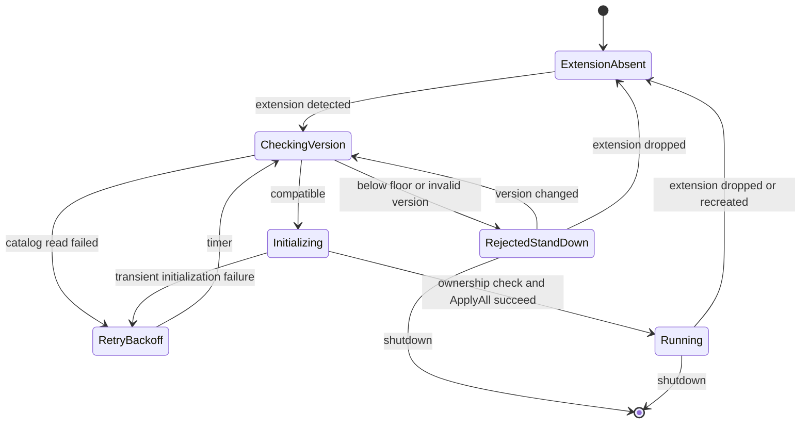

# fix: Harden provider compatibility rejection

> **Retained for reference.** All six units were implemented and verified. PR
> #339 was closed on 2026-08-11 for reasons unrelated to this plan's execution:
> v0.2.1 installations were found in the field, disproving the premise of the
> retirement this plan was hardening.
>
> Two consequences. Unit 6's F2 "unsupported lineage" decision is invalidated —
> see the note in `docs/retire-pr339-review.md`. And the guard's operator message
> is now wrong: it tells a below-floor operator to reinstall an older package,
> when the correct remedy is `ALTER EXTENSION pg_durable UPDATE` to 0.2.2 or
> later, provided the upgrade scripts are not deleted. The guard mechanism itself
> — refuse before `ApplyAll` touches provider state — remains sound and is the
> most reusable part of this work.

## Overview

Complete PR #339's retirement of pre-v0.2.2 compatibility by making the provider-floor guard safe, observable, and testable. The implementation will distinguish transient catalog failures from permanent incompatibility, prevent the background worker from hot-looping, reject engine-dependent backend calls even when readiness is stale or a client is cached, enforce SemVer ordering at the floor, strengthen lifecycle/security coverage, and harden the upgrade harness.

The ownership-conversion lineage identified by F2 remains intentionally unsupported. The code will not restore that repair path or add lineage detection. Operator documentation will state that recovery is destructive extension drop/recreate, with dependency review and explicit data-loss warnings.

## Problem Frame

PR #339 correctly removes unsupported pre-v0.2.2 query shapes and package upgrade edges, but its new guard overloads one error path for two different states. A successfully read incompatible version is permanent; a failed catalog read is transient. Both currently return `None` from `initialize_duroxide_runtime()`, and the outer worker loop immediately retries while the extension remains installed. This produces a CPU/query/log hot loop instead of standing down.

Backend sessions have a separate gap. `is_worker_ready()` is consulted only when constructing a cached Duroxide client, `_worker_ready` persists across package changes, and `WORKER_SCHEMA_VERSION` has remained `1` since v0.2.0. A pre-floor database can therefore carry apparently current readiness, or an already-cached client can bypass a newly introduced compatibility check. Engine-dependent commands need an independent floor check on every operation. Read-only inspection that depends only on `df` tables should remain available.

The approved decisions and evidence are recorded in `docs/retire-pr339-review.md`.

## Requirements Trace

- **R1 (F1).** A permanently incompatible extension version must not cause a no-backoff BGW retry loop or repeated refusal-log flood.
- **R2 (F1/F4).** Compatibility evaluation must distinguish compatible state, transient version-read failure, and permanent rejection.
- **R3 (F1/F4).** `df.start()`, `df.signal()`, and `df.cancel()` must reject a below-floor schema with an actionable compatibility message before trusting `_worker_ready`, constructing a provider, or using a cached client.
- **R4 (F1).** `df.status()`, `df.result()`, and other explicitly identified `df`-table-only inspection paths must remain available during compatibility rejection.
- **R5 (F3).** An integration test must prove that below-floor startup performs no provider DDL, does not rewrite readiness, remains responsive to lifecycle transitions, and does not hot-loop.
- **R6 (F4).** A transient `extversion` query failure must retry with interruptible backoff and must not emit the permanent incompatibility message.
- **R7 (F5).** A correctly named provider schema that is not owned by `pg_durable` must be rejected before provider construction or migration, with direct negative coverage.
- **R8 (F6).** Version comparison must follow SemVer at the floor: reject `0.2.2-rc1`, admit `0.2.2`, and admit prereleases whose numeric core is above the floor such as `0.2.4-rc1`.
- **R9 (F7).** B1 must positively prove expected provider objects exist before asserting that none are extension members.
- **R10 (F8).** The upgrade harness must reject empty or unusable provider-schema resolution immediately and diagnose readiness failures against the resolved schema.
- **R11 (F2).** Do not restore the v0.1.1 ownership conversion or promise in-place repair. Publish the unsupported-lineage decision and destructive drop/recreate recovery, including data loss, grant reapplication, and dependency/CASCADE warnings.
- **R12.** Supported v0.2.2-and-later schemas, current `df.start()` transaction modes, signal/cancel behavior, provider schema fallback, and extension drop/recreate lifecycle must not regress.

## Scope Boundaries

- Do not restore `has_extension_owned_duroxide_objects()` or `release_extension_owned_duroxide_objects()`.
- Do not add a lineage detector solely to produce a special F2 runtime message. Append conditional recovery guidance to BGW provider-initialization failures: if the database originated before v0.2.2 and still has extension-owned provider objects, retries cannot repair it and the operator must use the documented destructive reset. The message must not claim that every provider initialization failure has this cause.
- Do not reintroduce pre-v0.2.2 SQL fixtures, migration edges, `login_role` inserts, global-variable queries, or `_worker_epoch` readiness fallback.
- Do not add a public `df.worker_status()` SQL API, extension DDL, or an upgrade script for diagnostics.
- Do not make all monitoring APIs subject to the engine compatibility gate. Preserve `df`-table-only inspection; characterize provider-backed monitoring separately rather than claiming it is fully available.
- Do not redefine `_worker_ready` as a liveness signal. It remains a provider-schema initialization marker; compatibility is checked independently.
- Do not change `df.cancel()` from a returned failure string to a raised PostgreSQL error as part of this fix. Preserve each command's existing error contract while including the actionable compatibility message.
- Do not use `DROP EXTENSION ... CASCADE` as generic advice. It is an operator-selected destructive recovery only after dependency inventory and acceptance of the wider impact.

## Context & Research

### Relevant Code and Patterns

- `src/worker.rs` owns extension detection, epoch lifecycle, provider schema ownership verification, `MigrationPolicy::ApplyAll`, readiness recording, and interruptible retry patterns.
- `src/client.rs` owns the per-backend Duroxide client cache and the readiness gate shared by start, signal, and cancel. Compatibility must be checked before both client creation and cached-client use.
- `src/types.rs` contains SPI/sqlx provider-schema resolution and `VerifyOnly`/`ApplyAll` provider configuration. Keep the policy pure and the SPI/sqlx reads in their respective adapters.
- `src/dsl.rs` supplies the current ad hoc parser and preserves the command-specific error contracts: start raises and rolls back, signal raises, and cancel returns a failure string.
- `tests/e2e/sql/25_start_fail_fast.sql` proves failed enqueue rolls back start rows. It is the local pattern for backend fail-fast assertions but cannot alone prove BGW before-DDL ordering or log boundedness.
- `tests/e2e/sql/12_extension_lifecycle.sql` and the phase orchestration in `scripts/test-e2e-local.sh` provide patterns for extension absent/create/drop/recreate behavior.
- `scripts/test-upgrade.sh` owns provider schema resolution, readiness polling, B1 reconstruction, and extension-membership assertions.
- `CHANGELOG.md`, `USER_GUIDE.md`, `docs/bgw-applies-migrations.md`, and `docs/extension_lifecycle.md` are the operator-facing sources that currently describe readiness as temporary and retryable.

### Institutional Learnings

No `docs/solutions/` or `AGENTS.md` guidance exists in this checkout. Repository-level `.github/copilot-instructions.md` remains authoritative, especially the v0.2.2 provider compatibility floor, B1 direct-contact requirement, and preservation of supported catalog bindings.

### Research Conclusions

- A shared pure compatibility policy is preferable to sharing database access: BGW uses sqlx while backend sessions use SPI, and transient read failures must remain adapter errors rather than compatibility verdicts.
- Full SemVer parsing should replace suffix stripping. Use the existing dependency policy and lockfile conventions; a focused `semver` crate dependency is justified if the standard library cannot express the decided ordering without recreating SemVer.
- Permanent stand-down must be a lifecycle state, not another `Option::None` reason. It needs bounded polling for shutdown, extension removal, or version change and one log per state transition.
- Compatibility must be checked on every engine operation, not just uncached-client construction. Otherwise an already-cached client can bypass a later floor transition.
- The F5 test should prove no provider mutation over an observation interval. Missing schema/catalog-read failures remain transient; the current implementation need not gain a new permanent security-rejection state unless implementation evidence requires it.
- Plain `DROP EXTENSION pg_durable` is the approved first recovery command. If provider-schema dependencies prevent it, operators may choose `CASCADE` only after inventorying and accepting all dependent-object loss.

## Key Technical Decisions

- **Centralize policy, separate adapters.** Move the floor constant, SemVer comparison, and actionable rejection message into a small internal compatibility module. Keep SPI and sqlx catalog reads in `src/client.rs` and `src/worker.rs` so transient database errors retain their native error types.
- **Use explicit lifecycle outcomes.** Replace ambiguous `Option`-only initialization control flow with an internal result that distinguishes initialized runtime, extension gone/shutdown, transient retry, and permanent rejection. Exact type names are implementation details.
- **Stand down with bounded reevaluation.** On permanent rejection, log once and poll interruptibly at a bounded interval. Reevaluate when `extversion` changes, return to extension-wait when it is dropped, and exit on shutdown. Never invoke provider construction while rejected.
- **Guard every engine operation.** Check the installed extension version before `_worker_ready` and before executing through a cached client. A transient backend SPI read fails that invocation with a retryable diagnostic and does not create or retain a newly initialized client.
- **Preserve API-specific errors.** Start and signal continue raising; cancel continues returning its existing `Failed to cancel: ...` shape. All include the same actionable compatibility text.
- **Guarantee only table-only monitoring.** Preserve `df.status()`, `df.result()`, and terminal-state `df.await_instance()` because they read `df` tables directly. Provider-backed monitoring is characterized in tests/docs and is not advertised as available during rejection.
- **Test unsupported state without restoring support.** Dedicated lifecycle fixtures may construct a below-floor catalog state for verification, but package fixtures and production compatibility code remain v0.2.2+ only.
- **Keep F2 deferred.** Documentation and contextual provider-failure guidance, not runtime detection or repair, own the unsupported-lineage recovery contract. The support rationale remains the evidence recorded in the origin review: published open-source releases begin at v0.2.2, no known installation is reported to have started on v0.1.1, and no telemetry or population measurement exists.

## Open Questions

### Resolved During Planning

- **Should permanent rejection be visible outside logs?** Yes. Engine-dependent backend calls return the shared actionable compatibility message.
- **Should cached clients be exempt from compatibility checks?** No. Check compatibility on every engine operation.
- **Should read-only monitoring be blocked?** No for `df`-table-only APIs; provider-backed APIs receive no blanket availability guarantee.
- **Should cancel's public error behavior change?** No. Preserve its returned failure string while improving the embedded message.
- **Should F2 restore a read-only lineage detector?** No. The approved decision is defer/unsupported with destructive recovery.
- **Should floor prereleases be admitted?** No. Apply SemVer ordering.

### Deferred to Implementation

- **Compatibility module name and exact result types:** Choose the smallest arrangement consistent with existing module layout and clippy rules.
- **SemVer dependency vs. narrowly complete internal parser:** Prefer the established `semver` crate unless dependency review uncovers a repository policy conflict. Do not retain the current suffix-stripping comparator.
- **Dedicated E2E phase names and fixture placement:** Follow current `scripts/test-e2e-local.sh` phase conventions and keep destructive catalog manipulation isolated from the default database state.
- **Provider mutation sentinel:** Select stable catalog/object assertions after inspecting the pinned `duroxide-pg` migration objects during implementation; avoid coupling to incidental migration internals beyond the canonical objects already used by B1.
- **Transient-read unit seam:** Introduce only the minimum injection/helper boundary needed to deterministically test retry classification; do not add a general mocking framework.

## High-Level Technical Design

> *This illustrates the intended approach and is directional guidance for review, not implementation specification. The implementing agent should treat it as context, not code to reproduce.*



Backend engine-operation flow:

```text
read installed extversion
  -> transient read failure: fail this call with retryable diagnostic
  -> permanent rejection: fail with actionable floor/recovery message
  -> compatible: check _worker_ready
       -> not ready: existing temporary retry message
       -> ready: create or use cached VerifyOnly client and execute
```

## Implementation Units

- [x] **Unit 1: Centralize SemVer compatibility policy**

**Goal:** Create one pure provider-floor decision used by BGW and backend adapters, with correct SemVer boundary behavior.

**Requirements:** R2, R8, R12

**Dependencies:** None.

**Files:**
- Create or modify: `src/compatibility.rs` (final module name may follow local layout)
- Modify: `src/lib.rs`
- Modify: `src/dsl.rs`
- Modify: `src/worker.rs`
- Modify if dependency is used: `Cargo.toml`
- Modify if dependency is used: `Cargo.lock`
- Test: co-located unit tests in the compatibility module

**Approach:**
- Move `PROVIDER_COMPAT_FLOOR`, version parsing/comparison, and the permanent operator message out of worker/DSL concerns.
- Return a pure compatible/permanent-rejection decision for a successfully read version string. Database read errors remain outside this function.
- Remove `parse_semver()` and its obsolete DSL tests once no caller remains.
- Keep the recovery message aligned with the actual support policy: below-floor packages require an older package/downstream process; F2 admitted lineage uses destructive drop/recreate guidance in operator docs and as conditional context on provider-initialization failures, without pretending the version guard can identify lineage.

**Execution note:** Implement boundary tests before replacing the comparator.

**Patterns to follow:** Co-located Rust unit tests in `src/worker.rs` and explicit constants in `src/lib.rs`.

**Test scenarios:**
1. `0.2.1` is permanently rejected and the message names installed version, floor, retired provider line, and recovery direction.
2. `0.2.2-rc1` and earlier prereleases of the floor are rejected.
3. `0.2.2` and `0.2.2+build.metadata` are admitted.
4. `0.2.4-rc1`, `0.3.0-alpha.1`, and `1.0.0` are admitted because they order above the floor.
5. Malformed versions, missing components, extra numeric components, and overflow are rejected without panic.

**Verification:** One policy implementation owns all version ordering; no suffix-stripping parser remains; unit tests demonstrate the decided floor semantics.

- [x] **Unit 2: Make BGW compatibility handling stateful and bounded**

**Goal:** Separate transient catalog failures from permanent incompatibility and eliminate the hot loop while preserving drop/recreate recovery.

**Requirements:** R1, R2, R5, R6, R12

**Dependencies:** Unit 1.

**Files:**
- Modify: `src/worker.rs`
- Test: co-located worker state/helper unit tests
- Test/integration support: `scripts/test-e2e-local.sh`

**Approach:**
- Preserve sqlx errors from the `pg_extension.extversion` read so the caller can retry them with the existing interruptible backoff.
- Introduce an explicit initialization/stand-down outcome instead of using `None` for shutdown, extension removal, and permanent rejection.
- Log permanent rejection once when entering stand-down. Poll at a bounded interval for shutdown, extension absence, or an `extversion` change; do not resolve provider state or invoke `ApplyAll` while the same rejected version remains installed.
- On version change, rerun compatibility and all normal ownership/provider checks. On drop, return to extension creation wait. On shutdown, exit promptly.
- Keep missing schema and transient ownership-query failures on the existing retry path. Do not expand F5 into a new public behavior contract.
- When provider construction fails, retain retry behavior but add conditional F2 guidance to the log: a pre-v0.2.2 lineage with extension-owned provider objects is unsupported and requires destructive drop/recreate. Keep the underlying provider error intact so other causes remain diagnosable.

**Execution note:** Characterize current outer/inner loop transitions before changing return types.

**Patterns to follow:** `tokio::select!` interruptible sleeps in management-pool creation and provider initialization; extension epoch re-resolution in `run_duroxide_runtime()`.

**Test scenarios:**
1. A compatible version proceeds to ownership verification and provider construction.
2. A transient version-read error sleeps/retries, emits a retryable message, and never emits the permanent floor message.
3. A below-floor version enters stand-down, logs once over multiple poll intervals, and never reaches provider construction.
4. Shutdown interrupts both transient retry and permanent stand-down promptly.
5. Dropping the extension during stand-down returns to extension-wait state.
6. Changing from a rejected to a compatible version exits stand-down and initializes without PostgreSQL restart.

**Verification:** No path from a permanent rejection reaches the outer no-backoff `continue`; provider construction is unreachable while rejected; transient errors retain retry behavior.

- [x] **Unit 3: Gate backend engine operations independently of readiness**

**Goal:** Return actionable compatibility failures from engine-dependent SQL APIs and prevent stale readiness or cached clients from bypassing the floor.

**Requirements:** R3, R4, R6, R12

**Dependencies:** Unit 1.

**Files:**
- Modify: `src/client.rs`
- Modify as needed for error propagation only: `src/dsl.rs`
- Test: co-located unit tests in `src/client.rs`
- Test: `tests/e2e/sql/25_start_fail_fast.sql` or a focused lifecycle SQL fixture selected in Unit 4

**Approach:**
- Add an SPI adapter that reads `pg_extension.extversion`, applies the shared policy, and distinguishes transient SPI/catalog failure from permanent rejection.
- Run this adapter on every `with_duroxide_client()` operation before readiness and before cached-client execution.
- Do not cache a compatibility verdict. If a call fails compatibility, do not create a client; invalidate or avoid using any cached client for that call.
- Preserve the temporary readiness message for compatible versions whose BGW has not completed initialization.
- Preserve command contracts: start/signal raise through their current paths; cancel returns `Failed to cancel: <actionable message>` and does not update status.
- Leave `df.status()`, `df.result()`, and table-only `df.await_instance()` paths unchanged.

**Patterns to follow:** Existing client reset behavior in `with_duroxide_client()`, start fail-fast rollback, signal error propagation, and cancel's guarded status update.

**Test scenarios:**
1. Below-floor with absent readiness rejects start with the floor-specific message and no instance/node rows.
2. Below-floor with a matching stale `_worker_ready` row still rejects before provider creation.
3. A backend that previously cached a client rejects its next operation after the installed version becomes below floor.
4. A transient SPI version-read failure fails only that invocation with retryable guidance and does not cache a new client.
5. Compatible-but-not-ready retains the existing “not yet initialized” message.
6. Signal rejection sends no event.
7. Cancel rejection preserves the existing returned-string contract and leaves instance status unchanged.
8. `df.status()`, `df.result()`, and terminal-state `df.await_instance()` remain usable against seeded `df` rows during rejection.

**Verification:** Every engine operation evaluates compatibility before using the provider; stale readiness and cached-client tests fail against the old implementation and pass after the change.

- [x] **Unit 4: Add lifecycle and ownership integration coverage**

**Goal:** Prove the central safety and security ordering against a real PostgreSQL/BGW lifecycle.

**Requirements:** R5, R7, R12

**Dependencies:** Units 1–3.

**Files:**
- Modify: `scripts/test-e2e-local.sh`
- Create or modify: focused SQL fixtures under `tests/e2e/sql/` following lifecycle-phase conventions
- Test support as needed: `scripts/pg-start.sh`, `scripts/pg-stop.sh`, or existing helpers only if current phase APIs cannot express the setup

**Approach:**
- Add isolated lifecycle phases rather than contaminating the ordinary E2E database. Construct test-only catalog states with the worker stopped, then restart with preload.
- For below-floor coverage, seed a provider sentinel and stale readiness, set a test-only below-floor `extversion`, start the BGW, and observe behavior across multiple stand-down intervals.
- Assert before-DDL ordering through stable provider catalog/sentinel checks and readiness non-rewrite, not only through logs.
- Assert bounded refusal logging and responsive shutdown/drop/recreate behavior at the shell phase where logs and restarts are observable.
- For F5, create the expected provider schema name without extension ownership, start the BGW, and assert no provider objects/migrations are created. Keep the assertion focused on refusal-before-provider-construction; do not require a new permanent-vs-retry classification.
- Restore a clean current extension after each destructive phase and prove a normal workflow completes.

**Execution note:** Add failing lifecycle coverage before modifying worker control flow where feasible.

**Patterns to follow:** Dedicated no-preload/connection-limit phases in `scripts/test-e2e-local.sh`; extension lifecycle SQL in `tests/e2e/sql/12_extension_lifecycle.sql`; log inspection conventions already used by startup validation tests.

**Test scenarios:**
1. Below-floor plus stale readiness performs no provider migration/DDL and does not rewrite readiness.
2. Refusal log count remains bounded over several polling intervals; no CPU/query hot-loop proxy is observed.
3. Worker shutdown remains prompt while stood down.
4. Drop/recreate from rejected state initializes the current schema and completes a workflow.
5. Existing-but-unowned provider schema is rejected before any canonical provider object or migration record is created.
6. A catalog-backed `0.2.2-rc1` state follows the same before-DDL rejection path; final `0.2.2` initializes normally.
7. Fresh current install and supported v0.2.2 direct-contact behavior remain green after the new phases.

**Verification:** The tests exercise the actual BGW, catalog read, ownership check, provider-construction ordering, logs, and lifecycle transitions; pure-function tests are no longer the only evidence for the before-DDL safety property in R5, and the floor-prerelease boundary also receives one catalog-backed integration check.

- [x] **Unit 5: Harden upgrade harness provider assertions**

**Goal:** Make readiness/schema diagnostics immediate and ensure B1's ownership assertion cannot pass on an absent provider.

**Requirements:** R9, R10, R12

**Dependencies:** None; validate after Units 1–4 because the full upgrade suite is the compatibility gate.

**Files:**
- Modify: `scripts/test-upgrade.sh`
- Test: `scripts/test-upgrade.sh` scenarios A, B1, and B2

**Approach:**
- Make `resolve_provider_schema()` reject empty output and verify the resolved namespace exists.
- Quote or safely pass the resolved schema for catalog/readiness queries rather than treating helper output as unchecked SQL text.
- Keep `_worker_ready` polling inside the loop, but report whether resolution, namespace existence, table creation, or readiness-row population failed.
- Resolve the active provider schema in `test_b1_no_extension_owned_duroxide_objects()` instead of hardcoding `duroxide`.
- Positively assert a stable set of canonical provider objects exists, then assert those objects are not `pg_durable` extension members.

**Patterns to follow:** `run_sql_capture`, `assert_sql_equals`, and B1 per-version execution in `scripts/test-upgrade.sh`.

**Test scenarios:**
1. v0.2.2 fallback resolves `duroxide`, verifies its namespace/readiness, and passes canonical-object assertions.
2. Current/fresh schemas resolve their configured provider schema and pass the same assertions.
3. Empty helper output fails immediately with a direct diagnostic.
4. Missing resolved namespace fails immediately.
5. Existing provider with no canonical objects fails the positive assertion rather than producing a false green.
6. Existing canonical objects registered as extension members fail the membership assertion.

**Verification:** Scenario A, B1 for every supported version, and B2 pass; injected empty/missing-provider conditions fail at the intended assertion with clear messages.

- [x] **Unit 6: Publish runtime behavior and unsupported recovery**

**Goal:** Align operator guidance with the decided compatibility behavior and F2 support boundary.

**Requirements:** R3, R4, R11, R12

**Dependencies:** Units 1–5 so messages and tested behavior are final.

**Files:**
- Modify: `CHANGELOG.md`
- Modify: `USER_GUIDE.md`
- Modify: `docs/bgw-applies-migrations.md`
- Modify: `docs/extension_lifecycle.md`
- Modify if compatibility policy wording requires it: `docs/upgrade-testing.md`
- Modify if implementation guidance changes: `.github/copilot-instructions.md`

**Approach:**
- Distinguish temporary startup/read failures (“retry”) from permanent floor rejection (“operator action required”). Include the exact actionable message shape used by engine-dependent calls.
- Document that table-only monitoring remains available during rejection; avoid claiming provider-backed monitoring or worker liveness.
- Publish F2 as unsupported: no in-place repair, no restored ownership conversion, and no guarantee of a lineage-specific runtime diagnosis.
- State the evidence basis for accepting the unsupported lineage: published open-source releases begin at v0.2.2, no known installation started on v0.1.1, and no telemetry was available. Do not present absence of evidence as proof that the population is empty.
- Document recovery as backup/inventory followed by `DROP EXTENSION pg_durable` and `CREATE EXTENSION pg_durable`. State that this deletes durable instances, graph nodes, variables, execution history, provider state, and grants that must be reapplied.
- Explain that plain drop can fail on dependent provider objects. `CASCADE` is an optional operator decision only after listing dependencies and accepting all additional object loss.
- Correct any existing text that says every readiness failure can be fixed by waiting and retrying.

**Test expectation:** Documentation-only unit; validate links, command consistency, and agreement with the tested runtime messages.

**Verification:** Changelog and user/operator docs describe the same temporary/permanent states, monitoring boundary, and destructive recovery; no document promises automatic F2 repair.

## System-Wide Impact

- **Users:** Engine-dependent calls fail immediately with an actionable compatibility error instead of hanging, enqueueing stranded work, or returning only low-level provider failures. Table-only inspection remains available.
- **Operators:** The BGW stops consuming CPU/query/log capacity on permanent rejection and can recover after version correction or drop/recreate without a PostgreSQL restart. F2 recovery is explicitly destructive.
- **Developers:** Compatibility policy moves out of DSL parsing into a shared internal boundary with separate SPI/sqlx adapters and stronger lifecycle tests.
- **Packaging/upgrades:** No SQL artifact or supported schema shape changes. The existing v0.2.2 provider floor and deleted pre-floor upgrade edges remain unchanged.
- **Security:** The provider ownership check remains before `ApplyAll` and gains direct negative coverage.

## Risks and Mitigations

| Risk | Mitigation |
|---|---|
| Stand-down never notices an operator correction | Poll boundedly for extension OID/version changes and test both in-place version correction and drop/recreate. |
| Compatibility check on every call adds overhead | One small SPI catalog read only on engine-dependent commands; correctness outweighs premature caching, and no monitoring-wide gate is added. |
| Cached clients use stale provider state | Evaluate compatibility before every cached-client operation and invalidate/skip the client on rejection. |
| Lifecycle tests mutate `pg_extension` unsafely | Isolate them in dedicated disposable E2E phases with the BGW stopped during setup and recreate the extension afterward. |
| F5 test mistakes a transient missing schema for attacker ownership | Construct an existing, correctly named but non-extension-owned schema and assert only no-provider-mutation behavior. |
| SemVer dependency adds supply-chain/build churn | Use the established crate and lockfile process; keep it narrowly scoped and verify clippy/build. |
| Positive B1 object list becomes brittle across provider upgrades | Assert only canonical provider objects required by the provider contract; update deliberately with pinned `duroxide-pg` migrations. |
| Destructive recovery guidance causes unexpected collateral loss | Require backup and dependency inventory; explain plain drop failure and make `CASCADE` an explicit operator choice, not a default command. |
| F2 cannot be identified reliably without restoring a detector | Preserve the provider error and append conditional lineage/recovery guidance without claiming diagnosis; publish the limited release-history evidence behind the defer decision. |

## Verification Strategy

Implementation is complete when all of the following outcomes hold:

- Rust formatting, build, clippy, and unit tests are clean under the repository's pg17 configuration.
- Focused compatibility-policy tests cover all decided SemVer boundaries.
- Focused backend tests cover stale readiness, cached clients, API-specific error behavior, and start rollback.
- Dedicated lifecycle phases prove no provider DDL and bounded logs for below-floor startup, plus rejection of an unowned provider schema.
- The ordinary E2E suite remains green, including extension lifecycle, start fail-fast, user isolation, and transaction-mode coverage.
- The full upgrade harness passes Scenario A, B1 across v0.2.2 through the previous version, and B2.
- Shutdown coverage remains green while the worker is running, retrying, and permanently stood down.
- Repository search finds no claim that every readiness failure is transient and no promise of automatic repair for the deferred F2 lineage.

## Delivery Sequence

Land as one PR update, ordered internally:

1. Unit 1 establishes the shared policy and boundary tests.
2. Units 2 and 3 consume that policy in BGW and backend contexts.
3. Unit 4 proves cross-process ordering and lifecycle behavior.
4. Unit 5 strengthens the existing upgrade compatibility gate.
5. Unit 6 publishes final tested behavior and destructive recovery.

Do not mark the review findings resolved until their focused tests pass. F2 is resolved by the recorded defer/support decision and documentation, not by restoring code.
